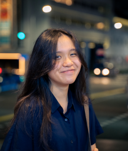

We are a team based in the [School of Computing, National University of Singapore](http://www.comp.nus.edu.sg).

You can reach us at the email `seer[at]comp.nus.edu.sg`

## Project team

### Li Rongzhi

[[github](https://github.com/li-rongzhi)]
[[portfolio](team/li-rongzhi.md)]

* Role: Developer

### Xu Shuyao

[[github](http://github.com/tim-siu)]
[[portfolio](team/tim-siu.md)]

* Role: Developer
* Responsibilities: Testing

### Tran Ha Thu

[[github](http://github.com/oeggy03)] 
[[portfolio](team/oeggy03.md)]

* Role: Developer
* Responsibilities: Tracking deliverables and deadlines

### Lim YingXuan

[[github](http://github.com/lunaroddity)] [[portfolio](team/lunaroddity.md)]

* Role: Developer
* Responsibilities: Documentation

### Yu Lexuan

[[github](http://github.com/Nauxe)] 
[[portfolio](team/nauxe.md)]

* Role: Developer
* Responsibilities: Code quality, Scheduling and tracking

