* Table of Contents
  {:toc}

--------------------------------------------------------------------------------------------------------------------

## **Acknowledgements**

* This project is based on the AddressBook-Level3 project created by the [SE-EDU initiative](https://se-education.org/).

--------------------------------------------------------------------------------------------------------------------

## **Setting up, getting started**

Refer to the guide [_Setting up and getting started_](SettingUp.md).

--------------------------------------------------------------------------------------------------------------------

## **Design**

:bulb: **Tip:** The `.puml` files used to create diagrams in this document `docs/diagrams` folder. Refer to the [
_PlantUML Tutorial_ at se-edu/guides](https://se-education.org/guides/tutorials/plantUml.html) to learn how to create
and edit diagrams.

### Architecture

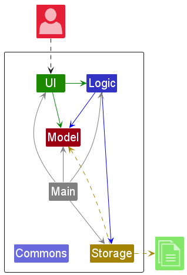

The ***Architecture Diagram*** given above explains the high-level design of the App.

Given below is a quick overview of main components and how they interact with each other.

**Main components of the architecture**

**`Main`** (consisting of
classes [`Main`](https://github.com/AY2324S1-CS2103T-T10-4/tp/blob/master/src/main/java/seedu/address/Main.java)
and [`MainApp`](https://github.com/AY2324S1-CS2103T-T10-4/tp/tree/master/src/main/java/seedu/address/MainApp.java)) is
in charge of the app launch and shut down.

* At app launch, it initializes the other components in the correct sequence, and connects them up with each other.
* At shut down, it shuts down the other components and invokes cleanup methods where necessary.

The bulk of the app's work is done by the following four components:

* [**`UI`**](#ui-component): The UI of the App.
* [**`Logic`**](#logic-component): The command executor.
* [**`Model`**](#model-component): Holds the data of the App in memory.
* [**`Storage`**](#storage-component): Reads data from, and writes data to, the hard disk.

[**`Commons`**](#common-classes) represents a collection of classes used by multiple other components.

**How the architecture components interact with each other**

The *Sequence Diagram* below shows how the components interact with each other for the scenario where the user issues
the command `delete 1`.

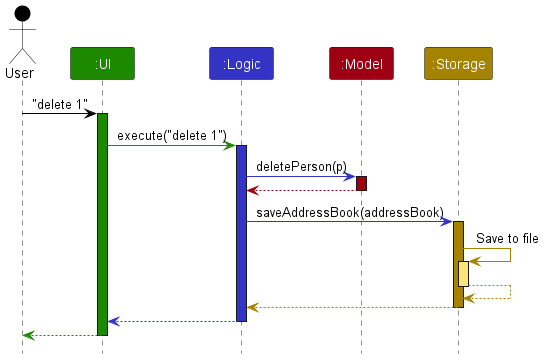

Each of the four main components (also shown in the diagram above),

* defines its *API* in an `interface` with the same name as the Component.
* implements its functionality using a concrete `{Component Name}Manager` class (which follows the corresponding
  API `interface` mentioned in the previous point.

For example, the `Logic` component defines its API in the `Logic.java` interface and implements its functionality using
the `LogicManager.java` class which follows the `Logic` interface. Other components interact with a given component
through its interface rather than the concrete class (reason: to prevent outside component's being coupled to the
implementation of a component), as illustrated in the (partial) class diagram below.

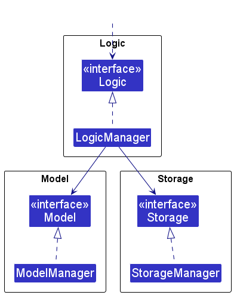

The sections below give more details of each component.

### UI component

The **API** of this component is specified
in [`Ui.java`](https://github.com/AY2324S1-CS2103T-T10-4/tp/tree/master/src/main/java/seedu/address/ui/Ui.java)

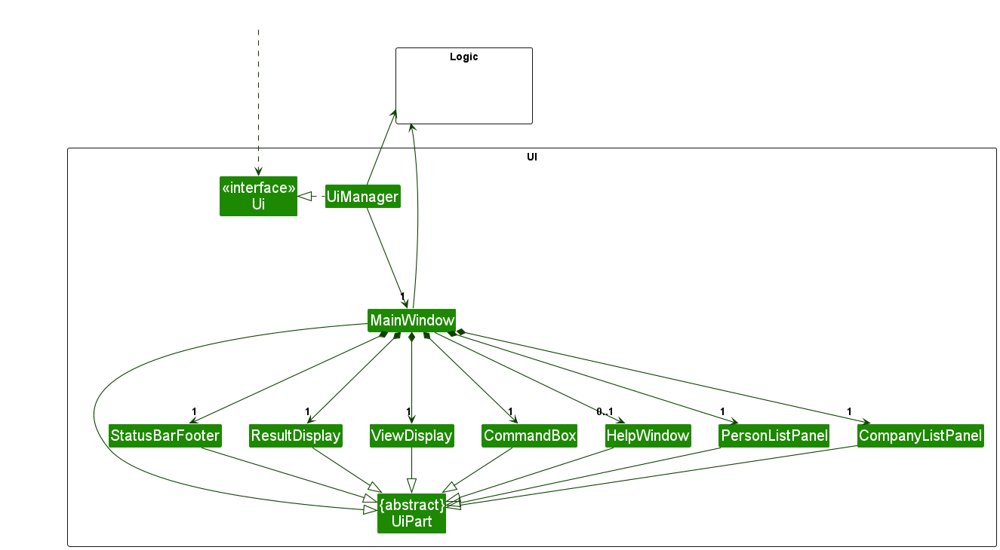

The UI consists of a `MainWindow` that is made up of parts
e.g.`CommandBox`, `ResultDisplay`, `PersonListPanel`, `CompanyListPanel`, `StatusBarFooter` etc. All these, including
the `MainWindow`, inherit from the abstract `UiPart` class which captures the commonalities between classes that
represent parts of the visible GUI.

The `UI` component uses the JavaFx UI framework. The layout of these UI parts are defined in matching `.fxml` files that
are in the `src/main/resources/view` folder. For example, the layout of
the [`MainWindow`](https://github.com/AY2324S1-CS2103T-T10-4/tp/tree/master/src/main/java/seedu/address/ui/MainWindow.java)
is specified
in [`MainWindow.fxml`](https://github.com/AY2324S1-CS2103T-T10-4/tp/tree/master/src/main/resources/view/MainWindow.fxml)

The `UI` component,

* executes user commands using the `Logic` component.
* listens for changes to `Model` data so that the UI can be updated with the modified data.
* keeps a reference to the `Logic` component, because the `UI` relies on the `Logic` to execute commands.
* depends on some classes in the `Model` component, as it displays `Person` or `Company` object residing in the `Model`.

### Logic component

**API
** : [`Logic.java`](https://github.com/AY2324S1-CS2103T-T10-4/tp/tree/master/src/main/java/seedu/address/logic/Logic.java)

Here's a (partial) class diagram of the entire `Logic` component:

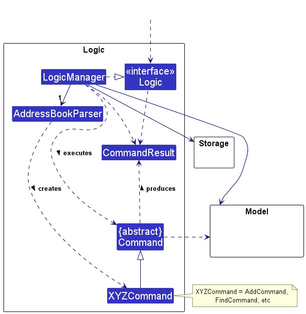

The sequence diagram below illustrates the interactions within the `Logic` component,
taking `execute("delete p 1")` API call as an example.

The command `delete p 1` deletes the first person listed in the list of people in the addressbook.

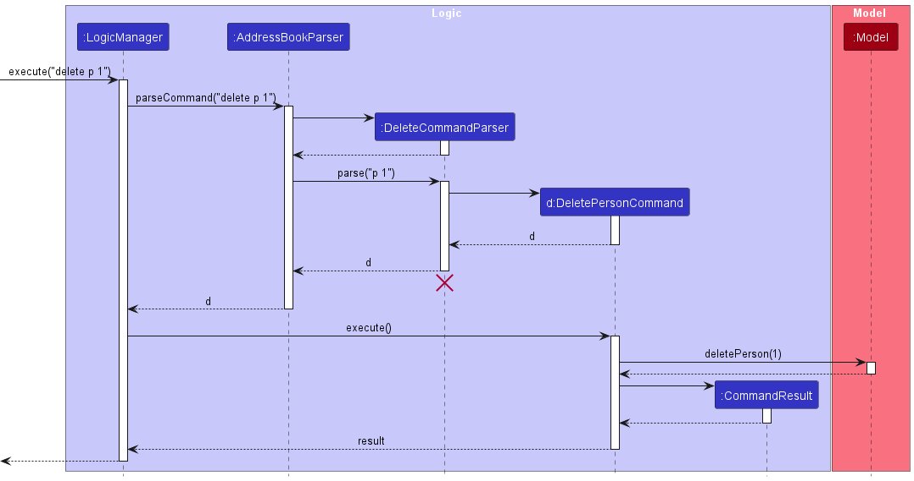

When executing a command that affects Company objects, the logic works similarly.

The sequence diagram below takes `execute("delete c 1")` API call as an example.
The command `delete c 1` deletes the first company listed in the list of companies in the addressbook.
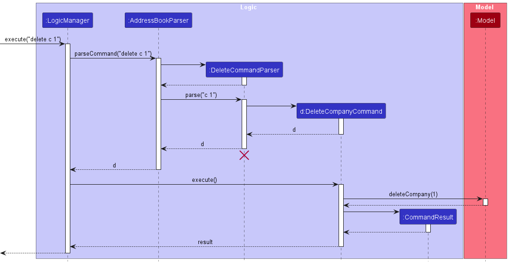

:information_source: **Note:** The lifeline for `DeleteCommandParser` should end at the destroy marker (X) but due to a limitation of PlantUML, the lifeline reaches the end of diagram.

How the `Logic` component works:

1. When `Logic` is called upon to execute a command, it is passed to an `AddressBookParser` object which in turn creates
   a parser that matches the command (e.g., `DeleteCommandParser`) and uses it to parse the command.
1. This results in a `Command` object (more precisely, an object of one of its subclasses e.g., `DeletePersonCommand`)
   which is executed by the `LogicManager`.
1. The command can communicate with the `Model` when it is executed (e.g. to delete a person).
1. The result of the command execution is encapsulated as a `CommandResult` object which is returned back from `Logic`.

Here are the other classes in `Logic` (omitted from the class diagram above) that are used for parsing a user command:

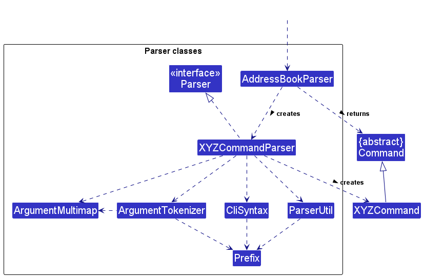

How the parsing works:

* When called upon to parse a user command, the `AddressBookParser` class creates an `XYZCommandParser` (`XYZ` is a
  placeholder for the specific command name e.g., `DeleteCommandParser`) which uses the other classes shown above to
  parse the user command and create a `XYZCommand` object (e.g., `DeleteCommand`) which the `AddressBookParser` returns
  back as a `Command` object.
* All `XYZCommandParser` classes (e.g., `AddCommandParser`, `DeleteCommandParser`, ...) inherit from the `Parser`
  interface so that they can be treated similarly where possible e.g, during testing.

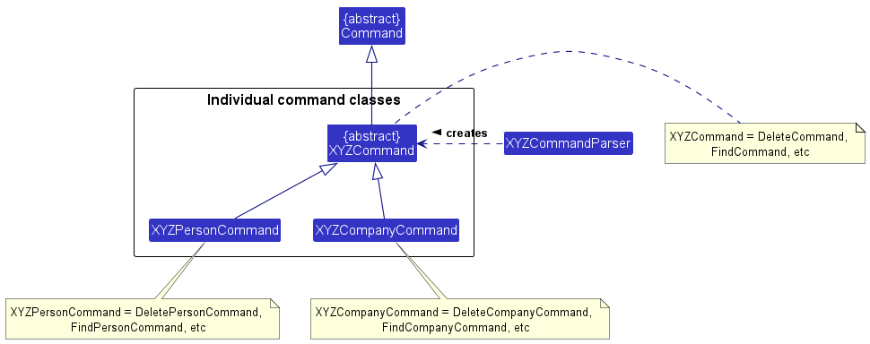

Due to our two main entities (`Person` and `Company`) having similar commands (e.g. Delete, Find, Add...), there are
packages for such commands to improve abstraction.
In these packages (e.g. deletecommand, findcommand packages), we can find the class `XYZCommand` that is created
by `XYZCommandParser`.

How `XYZCommandParser` works:

* When called upon to parse a command argument (e.g. `p 1` in `delete p 1`), it determines whether the argument wants to
  work with the persons entity, or the companies. This is often determined by `p` or `c` (e.g. `delete p 1` deletes the
  first person, `delete c 1` deletes the first company).
* `XYZCommandParser` then returns the appropriate `XYZCommand` class. For people, this is `XYZPersonCommand`, and for
  companies, `XYZCompanyCommand`.

### Model component

**API
** : [`Model.java`](https://github.com/AY2324S1-CS2103T-T10-4/tp/tree/master/src/main/java/seedu/address/model/Model.java)

Here's a (partial) class diagram of the entire `Model` component:

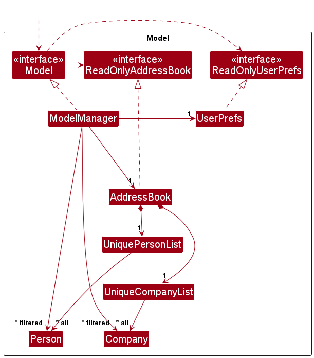

The `Model` component,

* stores the address book data i.e., all `Person` objects (which are contained in a `UniquePersonList` object), and
  all `Company` objects (which are contained in a `UniqueCompanyList` object)
* stores the currently 'selected' `Person` or `Company` objects (e.g., results of a search query) as a separate
  _filtered_ list which is exposed to outsiders as an unmodifiable `ObservableList<Person>` or `ObservableList<Company>`
  respectively that can be 'observed' e.g. the UI can be bound to this list so that the UI automatically updates when
  the data in the list change.
* stores a `UserPref` object that represents the user’s preferences. This is exposed to the outside as
  a `ReadOnlyUserPref` objects.
* does not depend on any of the other three components (as the `Model` represents data entities of the domain, they
  should make sense on their own without depending on other components)

`Model` has 2 main packages: persons and companies. (`Person` and `Company` class details omitted from the class diagram
above)

The details of the `Person` class is shown below:

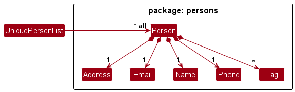

The details of the `Company` class is shown below:

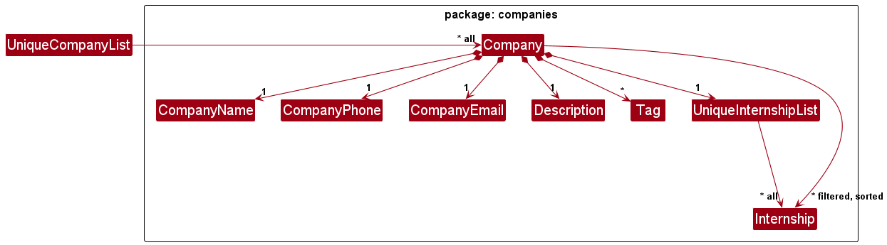

### Storage component

**API
** : [`Storage.java`](https://github.com/AY2324S1-CS2103T-T10-4/tp/tree/master/src/main/java/seedu/address/storage/Storage.java)

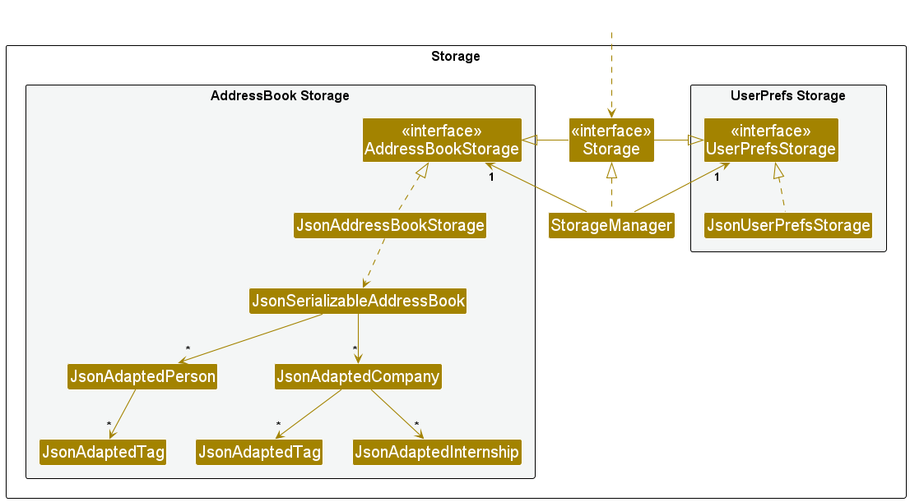

The `Storage` component,

* can save both address book data and user preference data in JSON format, and read them back into corresponding
  objects.
* inherits from both `AddressBookStorage` and `UserPrefStorage`, which means it can be treated as either one (if only
  the functionality of only one is needed).
* depends on some classes in the `Model` component (because the `Storage` component's job is to save/retrieve objects
  that belong to the `Model`)

### Common classes

Classes used by multiple components are in the `seedu.addressbook.commons` package.

#### The `AppUtil` class:

is a container for App specific utility functions.

#### The `CollectionUtil` class:

contains utility methods related to Collections.

#### The `ConfigUtil` class:

a class for accessing the Config File.

#### The `DateTimeParserUtil` class:

handles all the parsing of Strings into LocalDateTime objects, and vice versa. The format of the String is determined by
the final static variables `DATE_FORMAT` and `TIME_FORMAT`.

#### The `FileUtil` class:

writes and reads files.

#### The `JsonUtil` class:

converts a Java object instance to JSON and vice versa.

#### The `StringUtil` class:

contains helper functions for handling strings.

#### The `ToStringBuilder` class:

builds a string representation of an object.

--------------------------------------------------------------------------------------------------------------------

## **Implementation**

This section describes some noteworthy details on how certain features are implemented.

### \[V1.3\] Improved find feature for person and company

#### Implementation

The `FindPersonCommand` is implemented as follows:

* The `LogicManager`'s execute method is called with the command string.
* The `LogicManager` calls the `parseCommand()` method of the `AddressBookParser` class.
* The `AddressBookParser` creates a `FindCommandParser` which parses the user input and returns a `FindPersonCommand`
  object.
* The `FindPersonParser` is implemented as follows:
    * It uses the `ArgumentMultimap` class to parse the user input into a `Map` of keywords and tags.
    * It uses the `NameAndTagContainKeywordsPredicate` class to create a `Predicate` object that can be used to filter
      the list of persons.
    * It returns a `FindPersonCommand` object containing the `Predicate` object.
* The `FindPersonCommand` object is executed by the `LogicManager`.
* The `FindPersonCommand` communicate with the `Model` to filter the list of persons using the `Predicate` object.
* The `FindPersonCommand` creates a `CommandResult` object containing the filtered list of persons and returns it to
  the `LogicManager`.
* The `LogicManager` passes the `CommandResult` object to the `Ui` which displays the filtered list of persons.

The `FindCompanyCommand` is implemented similarly.

#### Sequence diagram

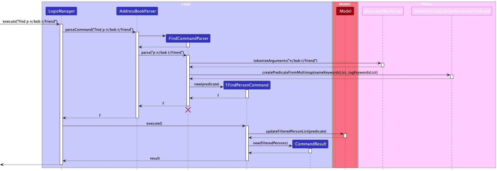

#### Design Considerations

When refining the `FindPersonCommand` and `FindCompanyCommand`, careful thought was given to ensure that the implementation was consistent with the existing command structure. Key considerations included:

* **Consistency with Existing Patterns**: The commands follow the established patterns of the application, ensuring that the new feature integrates smoothly with the existing codebase.

* **Command Differentiation**: The distinction between finding a person and a company is made in the `FindCommandParser` to minimize complexity in the `AddressBookParser`. This maintains the simplicity and single-responsibility of the `AddressBookParser`.

* **Separate Command Classes**: Separate classes for `FindPersonCommand` and `FindCompanyCommand` were chosen over a unified `FindCommand` to keep the predicate handling specific and clear, avoiding a single class becoming overly complex by handling multiple object types.

#### Alternatives Considered

* **Unified `FindCommand` Class**: A single `FindCommand` class handling both persons and companies was considered to promote code reuse. The downside to this approach would be reduced readability and increased complexity within the class, as it would need to conditionally handle two different data types.

* **Parsing at `AddressBookParser` Level**: Moving the differentiation logic to the `AddressBookParser` class was another alternative. This was rejected to avoid overcomplicating a class that should remain streamlined for parsing a variety of commands.

### \[V1.3\] View a single contact feature

The `ViewPersonCommand` is implemented as follows:

* The `LogicManager`'s execute method is called with the command string.
* The `LogicManager` calls the `parseCommand()` method of the `AddressBookParser` class.
* The `AddressBookParser` creates a `ViewCommandParser` which parses the user input and returns the `ViewPersonCommand`
  object.
* The `ViewCommandParser` is implemented as follows:
    * It parses the index using the `parseIndex` method from the `ParserUtil` which is stored in the `Index` object.
    * It returns the `ViewPersonCommand` object containing the `Index` object.
* The `ViewPersonCommand` object is executed by the `LogicManager`.
* The `ViewPersonCommand` communicates with the `Model` to retrieve the last shown list of persons.
* The `ViewPersonCommand` retrieves the `Person` object from the list of persons using the `Index` object.
* The `ViewPersonCommand` creates a `CommandResult` object containing the `Person` object and returns it to the
  `LogicManager`.
* The `LogicManager` passes the `CommandResult` object to the `Ui` which displays the `Person` object.

The `ViewCompanyCommand` is implemented similarly.

#### Sequence diagram

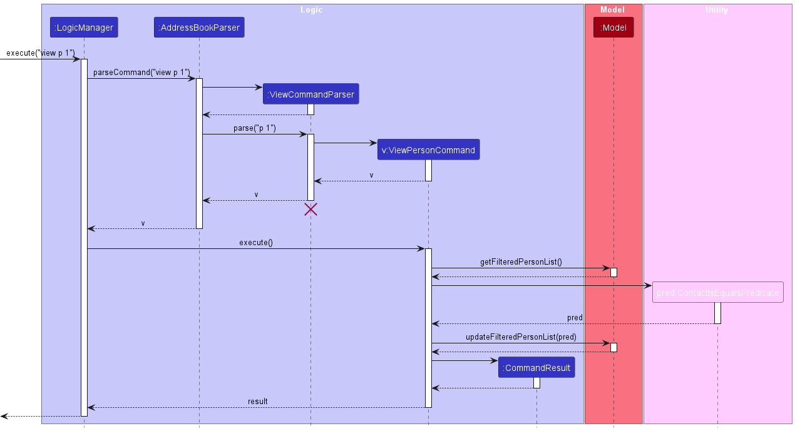

#### Design considerations

* The implementation follows the pattern of the existing commands as far as possible.
* The differentiation between the `ViewPersonCommand` and `ViewCompanyCommand` is done in the `ViewCommandParser` class
  instead of `AddressBookParser` class as we want to keep the `AddressBookParser` class simple. This also maintains the
  SLAP principle.
* The `ViewPersonCommand` and `ViewCompanyCommand` are implemented as separate classes instead of a single `ViewCommand`
  class to allow for easy extension for other types of contact objects.

#### Alternatives considered

* Implementing the `ViewPersonCommand` and `ViewCompanyCommand` as a single `ViewCommand` class would enable for more
  code reuse. However, this would make the `ViewCommand` too complex and difficult-to-read as it would have to account
  for both `Person` and `Company` objects. This complexity will only increase if other types of contact objects are
  introduced.
* An alternative is to differentiate between the `ViewPersonCommand` and `ViewCompanyCommand` in the `AddressBookParser`
  class. However, such implementation will make the `AddressBookParser` class more complex and difficult to maintain.
* Another alternative is implementing `ViewPersonCommand` and `ViewCompanyCommand` as a type of `ListCommand` as they
  are both related to the listing of contacts. However, this would limit the type of information that can be shown by
  the `View` commands as they would use the same list as the `List` commands.

### \[V1.4\] Sort company list feature

The `SortCompanyCommand` is implemented as follows:

* The `LogicManager`'s execute method is called with the command string.
* The `LogicManager` calls the `parseCommand()` method of the `AddressBookParser` class.
* The `AddressBookParser` creates a `SortCommandParser` which parses the user input and returns the `SortCompanyCommand`
  object.
* The `SortCommandParser` is implemented as follows:
    * It calls the `parseSortInterval` method from the `ParserUtil` to get the start and end time of the sort interval.
    * It returns the `SortCompanyCommand` object containing the start and end time of the sort interval.
* The `SortCompanyCommand` object is executed by the `LogicManager`.
* The `SortCompanyCommand` communicates with the `Model` by passing the start and end time to retrieve the list of companies.
* The `ModelManager` create a `CompanyDateRangePredicate` and a `CompanyDateComparator` object using the start and end time of
  the sort interval.
* The `ModelManager` filters the list of companies using the `CompanyDateRangePredicate` object.
* The `ModelManager` sorts the filtered list of companies using the `CompanyDateComparator` object.
* The `SortCompanyCommand` creates a `CommandResult` object containing the sorted list of companies and returns it to
  the `LogicManager`.
* The `LogicManager` passes the `CommandResult` object to the `Ui` which displays the sorted list of companies.

#### Sequence diagram
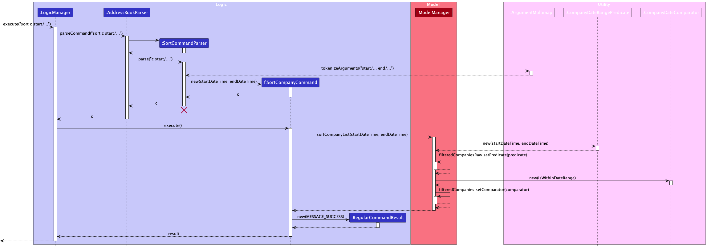

#### Design Considerations

When implementing the `SortCompanyCommand`, several design considerations were taken into account:

* **Separation of Concerns**: The parsing of the command and the execution logic are kept separate. Parsing is handled by `AddressBookParser` and `SortCommandParser`, while execution is managed by `LogicManager` and `ModelManager`. This ensures that each class is responsible for a single aspect of the command's operation, aligning with the Single Responsibility Principle.

* **Command Object Pattern**: By encapsulating the sorting operation within a `SortCompanyCommand` object, we can easily extend or modify the sorting behavior without affecting other parts of the system.

* **Use of Comparators and Predicates**: Using the `CompanyDateRangePredicate` and `CompanyDateComparator` allows for a clean and reusable way to filter and sort the list of companies, respectively. It provides flexibility if additional sorting criteria are required in the future.

* **Model-Driven Sorting**: Placing the logic of sorting within the model (`ModelManager`) rather than the command object emphasizes that the model is the source of truth for data manipulation and business logic.

#### Alternatives Considered

* **Sorting in the Command Object**: Initially, sorting could have been implemented directly in the `SortCompanyCommand`. However, this was rejected to keep the command object simple and to maintain the integrity of the model as the primary handler of data operations.

* **Static Utility Methods**: Rather than creating comparator and predicate objects, static utility methods could have been used for sorting and filtering. This approach was discarded because it would be less flexible and would not allow for easy adjustments or extensions of sorting criteria.

* **In-memory vs Database Sorting**: Deciding where to perform the sorting operation—whether in memory or through a database query—was an important consideration. In-memory sorting was chosen for its simplicity and because it does not require additional database support, but for larger datasets, database-level sorting might be more efficient.

[//]: # (### \[Proposed\] Undo/redo feature)

[//]: # ()
[//]: # (#### Proposed Implementation)

[//]: # ()
[//]: # (The proposed undo/redo mechanism is facilitated by `VersionedAddressBook`. It extends `AddressBook` with an undo/redo)

[//]: # (history, stored internally as an `addressBookStateList` and `currentStatePointer`. Additionally, it implements the)

[//]: # (following operations:)

[//]: # ()
[//]: # (* `VersionedAddressBook#commit&#40;&#41;`— Saves the current address book state in its history.)

[//]: # (* `VersionedAddressBook#undo&#40;&#41;`— Restores the previous address book state from its history.)

[//]: # (* `VersionedAddressBook#redo&#40;&#41;`— Restores a previously undone address book state from its history.)

[//]: # ()
[//]: # (These operations are exposed in the `Model` interface as `Model#commitAddressBook&#40;&#41;`, `Model#undoAddressBook&#40;&#41;`)

[//]: # (and `Model#redoAddressBook&#40;&#41;` respectively.)

[//]: # ()
[//]: # (Given below is an example usage scenario and how the undo/redo mechanism behaves at each step.)

[//]: # ()
[//]: # (Step 1. The user launches the application for the first time. The `VersionedAddressBook` will be initialized with the)

[//]: # (initial address book state, and the `currentStatePointer` pointing to that single address book state.)

[//]: # ()
[//]: # (![UndoRedoState0]&#40;images/UndoRedoState0.png&#41;)

[//]: # ()
[//]: # (Step 2. The user executes `delete 5` command to delete the 5th person in the address book. The `delete` command)

[//]: # (calls `Model#commitAddressBook&#40;&#41;`, causing the modified state of the address book after the `delete 5` command executes)

[//]: # (to be saved in the `addressBookStateList`, and the `currentStatePointer` is shifted to the newly inserted address book)

[//]: # (state.)

[//]: # ()
[//]: # (![UndoRedoState1]&#40;images/UndoRedoState1.png&#41;)

[//]: # ()
[//]: # (Step 3. The user executes `add n/David …​` to add a new person. The `add` command also)

[//]: # (calls `Model#commitAddressBook&#40;&#41;`, causing another modified address book state to be saved into)

[//]: # (the `addressBookStateList`.)

[//]: # ()
[//]: # (![UndoRedoState2]&#40;images/UndoRedoState2.png&#41;)

[//]: # ()
[//]: # (
:information_source: **Note:** If a command fails its execution, it will not call `Model#commitAddressBook&#40;&#41;`, so the address book state will not be saved into the `addressBookStateList`.)

[//]: # ()
[//]: # (
)

[//]: # ()
[//]: # (Step 4. The user now decides that adding the person was a mistake, and decides to undo that action by executing)

[//]: # (the `undo` command. The `undo` command will call `Model#undoAddressBook&#40;&#41;`, which will shift the `currentStatePointer`)

[//]: # (once to the left, pointing it to the previous address book state, and restores the address book to that state.)

[//]: # ()
[//]: # (![UndoRedoState3]&#40;images/UndoRedoState3.png&#41;)

[//]: # ()
[//]: # (
:information_source: **Note:** If the `currentStatePointer` is at index 0, pointing to the initial AddressBook state, then there are no previous AddressBook states to restore. The `undo` command uses `Model#canUndoAddressBook&#40;&#41;` to check if this is the case. If so, it will return an error to the user rather)

[//]: # (than attempting to perform the undo.)

[//]: # ()
[//]: # (
)

[//]: # ()
[//]: # (The following sequence diagram shows how the undo operation works:)

[//]: # ()
[//]: # (![UndoSequenceDiagram]&#40;images/UndoSequenceDiagram.png&#41;)

[//]: # ()
[//]: # (
:information_source: **Note:** The lifeline for `UndoCommand` should end at the destroy marker &#40;X&#41; but due to a limitation of PlantUML, the lifeline reaches the end of diagram.)

[//]: # ()
[//]: # (
)

[//]: # ()
[//]: # (The `redo` command does the opposite — it calls `Model#redoAddressBook&#40;&#41;`, which shifts the `currentStatePointer` once)

[//]: # (to the right, pointing to the previously undone state, and restores the address book to that state.)

[//]: # ()
[//]: # (
:information_source: **Note:** If the `currentStatePointer` is at index `addressBookStateList.size&#40;&#41; - 1`, pointing to the latest address book state, then there are no undone AddressBook states to restore. The `redo` command uses `Model#canRedoAddressBook&#40;&#41;` to check if this is the case. If so, it will return an error to the user rather than attempting to perform the redo.)

[//]: # ()
[//]: # (
)

[//]: # ()
[//]: # (Step 5. The user then decides to execute the command `list`. Commands that do not modify the address book, such)

[//]: # (as `list`, will usually not call `Model#commitAddressBook&#40;&#41;`, `Model#undoAddressBook&#40;&#41;` or `Model#redoAddressBook&#40;&#41;`.)

[//]: # (Thus, the `addressBookStateList` remains unchanged.)

[//]: # ()
[//]: # (![UndoRedoState4]&#40;images/UndoRedoState4.png&#41;)

[//]: # ()
[//]: # (Step 6. The user executes `clear`, which calls `Model#commitAddressBook&#40;&#41;`. Since the `currentStatePointer` is not)

[//]: # (pointing at the end of the `addressBookStateList`, all address book states after the `currentStatePointer` will be)

[//]: # (purged. Reason: It no longer makes sense to redo the `add n/David …​` command. This is the behavior that most modern)

[//]: # (desktop applications follow.)

[//]: # ()
[//]: # (![UndoRedoState5]&#40;images/UndoRedoState5.png&#41;)

[//]: # ()
[//]: # (The following activity diagram summarizes what happens when a user executes a new command:)

[//]: # ()
[//]: # ()

[//]: # ()
[//]: # (#### Design considerations:)

[//]: # ()
[//]: # (**Aspect: How undo & redo executes:**)

[//]: # ()
[//]: # (* **Alternative 1 &#40;current choice&#41;:** Saves the entire address book.)

[//]: # (    * Pros: Easy to implement.)

[//]: # (    * Cons: May have performance issues in terms of memory usage.)

[//]: # ()
[//]: # (* **Alternative 2:** Individual command knows how to undo/redo by)

[//]: # (  itself.)

[//]: # (    * Pros: Will use less memory &#40;e.g. for `delete`, just save the person being deleted&#41;.)

[//]: # (    * Cons: We must ensure that the implementation of each individual command are correct.)

[//]: # ()
[//]: # (_{more aspects and alternatives to be added}_)

[//]: # ()
[//]: # (### \[Proposed\] Data archiving)

[//]: # ()
[//]: # (_{Explain here how the data archiving feature will be implemented}_)

--------------------------------------------------------------------------------------------------------------------

## **Documentation, logging, testing, configuration, dev-ops**

* [Documentation guide](Documentation.md)
* [Testing guide](Testing.md)
* [Logging guide](Logging.md)
* [Configuration guide](Configuration.md)
* [DevOps guide](DevOps.md)

--------------------------------------------------------------------------------------------------------------------

## **Appendix: Requirements**

### Product scope

**Target user profile**:

* majors in Computing at NUS
* searching for job opportunities or internships
* prefers swift and organized tracking for application processes
* prefers desktop apps for managing applications and contacts

**Value proposition**: Efficiently manage job and internship applications and vital contacts with clear timelines using
a desktop app.

### User stories

Priorities: High (must have) - `* * *`, Medium (nice to have) - `* *`, Low (unlikely to have) - `*`

| Priority | As a …​                                           | I want to …​                        | So that I can…​                                                      |
|----------|---------------------------------------------------|-------------------------------------|----------------------------------------------------------------------|
| `* * *`  | CS student at NUS                                 | add companies with openings         | keep track of potential internship/job opportunities                 |
| `* * *`  | CS student at NUS                                 | delete company applications         | declutter and focus on companies I'm truly interested in             |
| `* * *`  | CS student at NUS                                 | view all company applications       | have a comprehensive overview of my potential opportunities          |
| `* * *`  | CS student at NUS                                 | add seniors’ contact information    | connect for potential collaborative projects                         |
| `* * *`  | CS student at NUS                                 | add professors’ contact information | seek guidance or ask academic-related questions                      |
| `* * *`  | CS student at NUS                                 | add contacts from networking events | have a database for potential job or internship references           |
| `* * *`  | CS student at NUS                                 | view each contact                   | access their details swiftly when needed                             |
| `* * *`  | CS student at NUS                                 | delete contacts                     | keep my contacts list updated and organized                          |
| `* *`    | CS student frequently attending networking events | categorize contacts                 | easily differentiate between professors, seniors, and other contacts |

*{More to be added}*

### Use cases

(For all use cases below, the **System** is the `SOCareers` and the **Actor** is the `User`, unless specified otherwise)

**Use case: Add a new company**

**MSS**

1. User requests to list companies.
2. SOCareers shows a list of companies.
3. User requests to add a new company to the list.
4. SOCareers prompts the user to enter the company details.
5. User enters the company details.
6. SOCareers validates the provided details.
7. SOCareers adds the company to the list.
8. SOCareers displays a message confirming the addition of the company.

   Use case ends.

**Extensions**

* 2a. The list is empty.

  Use case ends.

* 6a. SOCareers detects an error in the entered details.

    * 6a1. SOCareers requests for the correct details.
    * 6a2. User enters new details.
      Steps 6a1-6a2 are repeated until the details entered are correct.
      Use case resumes from step 7.

* *a. At any point, User decides to abort adding a new company.
    * *a1. SOCareers displays a message confirming the cancellation.
      Use case ends.

**Use case: Add contact information**

**MSS**

1. User requests to add contact information.
2. SOCareers prompts the user for the name of the contact.
3. User enters the name.
4. SOCareers prompts the user for contact information.
5. User enters the contact details.
6. SOCareers validates the provided details.
7. SOCareers adds the contact information to the contacts list.
8. SOCareers displays a message confirming the addition of the contact information.

   Use case ends.

**Extensions**

* 6a. SOCareers detects an error in the entered details.

    * 6a1. SOCareers requests for the correct details depending on the error.
    * 6a2. User enters new details.
      Steps 6a1-6a2 are repeated until the details entered are correct.
      Use case resumes from step 7.

* *a. At any point, User decides to abort adding contact information.
    * *a1. SOCareers displays a message confirming the cancellation.
      Use case ends.

**Use case: Delete company applications**

**MSS**

1. User requests to list company applications.
2. SOCareers shows a list of company applications.
3. User selects a certain company application for deletion.
4. SOCareers prompts for confirmation.
5. User confirms.
6. SOCareers deletes the selected company application.
7. SOCareers displays a message confirming the deletion.

   Use case ends.

**Extensions**

* 2a. The list is empty.

  Use case ends.

**Use case: View all company applications**

**MSS**

1. User requests to view all company applications.
2. SOCareers displays a comprehensive list of company applications.

   Use case ends.

**Use case: View a specific contact**

**MSS**

1. User requests to view a specific contact.
2. SOCareers displays the detailed information of the selected contact.

   Use case ends.

**Use case: Delete contacts**

**MSS**

1. User requests to list contacts.
2. SOCareers shows a list of contacts.
3. User selects a certain contact for deletion.
4. SOCareers prompts for confirmation.
5. User confirms.
6. SOCareers deletes the selected contact.
7. SOCareers displays a message confirming the deletion.

   Use case ends.

**Extensions**

* 2a. The list is empty.

  Use case ends.

**Use case: Categorize contacts**

**MSS**

1. User requests to categorize a contact.
2. SOCareers prompts the user to select a category (professors, seniors, others).
3. User selects the desired category.
4. SOCareers categorizes the contact accordingly.
5. SOCareers displays a message confirming the categorization.

   Use case ends.

**Extensions**

* 2a. The contact list is empty.

  Use case ends.

* 4a. The category selected already exists for the contact.

    * 4a1. SOCareers displays an error message indicating the contact is already categorized under the selected
      category.

  Use case resumes at step 2.

*{More to be added}*

### Non-Functional Requirements

1. Should work on standard student laptops and desktops.
2. Should be able to manage up to 1000 companies and contacts without degradation in performance.
3. A CS student who is not proficient in tech should be able to use all functionalities within 3 clicks.

*{More to be added}*

### Glossary

* **SOCareers**: A desktop application for NUS Computing majors to streamline their job and internship applications.
* **Contact**: A company or person of interest saved to SOCareers.
* **User**: CS majors at NUS looking for job or internship opportunities.

--------------------------------------------------------------------------------------------------------------------

## **Appendix: Instructions for manual testing**

Given below are instructions to test the app manually.

:information_source: **Note:** For the most recent updates on commands and features, please refer to the User Guide. The User Guide is continuously updated to reflect the latest changes and will provide you with the most current instructions and examples for using the system effectively.

:information_source: **Note:** These instructions only provide a starting point for testers to work on;
testers are expected to do more *exploratory* testing.

### Launch and shutdown

1. Initial launch

    1. Download the jar file and copy into an empty folder

    1. Run the jar file using command `java -jar`. Expected: Shows the GUI with a set of sample contacts. The window
       size may not be
       optimum.

1. Saving window preferences

    1. Resize the window to an optimum size. Move the window to a different location. Close the window.

    1. Re-launch the app by running the jar file using `java -jar` 
       Expected: The most recent window size and location is retained.

1. _{ more test cases …​ }_

### Command Testing

#### Adding A Person or A Company

1. Adding a person

    1. Test case: `add p n/Tom p/12345678 e/tom@gmail.com a/Kent Ridge Road t/friend` 
       Expected: A person contact with the given information is added to the end of the person contact list.
       Details of the newly added person contact shown in the status message. Timestamp in the status bar is updated.

    1. Test case: `add p n/Tom` 
       Expected: No person is added due to field missing (Only the tag field with `t/` prefix is optional). Error
       details shown in the status message. Status bar remains the same.

    1. Other incorrect add person commands to try: `add p`, `add p n/Tom p/12345678`, `...` (where compulsory fields are
       missing) 
       Expected: Similar to previous.

2. Adding a company

    1. Test case: `add c n/ByteDance p/12345678 e/bytedance@example.com d/Cool Company t/social media` 
       Expected: A company contact with the given information is added to the end of the company contact list.
       Details of the newly added company contact shown in the status message. Timestamp in the status bar is updated.

    1. Test case: `add c n/ByteDance` 
       Expected: No company is added due to field missing (Only the tag field with `t/` prefix is optional). Error
       details shown in the status message. Status bar remains the same.

    1. Other incorrect add company commands to try: `add c`, `add c n/ByteDance p/12345678`, `...` (where compulsory
       fields are missing) 
       Expected: Similar to previous.

#### Listing All Persons or All Companies

1. Listing all persons

    1. Prerequisite: Have at least 1 person contact in the storage
    1. Test case: `list p` 
       Expected: All person contacts are displayed. Timestamp in the status bar is updated.
    1. Test case: `list` 
       Expected: The displayed person contacts remains due to missing of `p` keyword. Error details shown in the status
       message. Status bar remains the same.

2. Listing all companies

    1. Prerequisite: Have at least 1 company contact in the storage
    1. Test case: `list c` 
       Expected: All company contacts are displayed. Timestamp in the status bar is updated.
    1. Test case: `list` 
       Expected: The displayed company contacts remains due to missing of `c` keyword. Error details shown in the status
       message. Status bar remains the same.

#### Editing A Person or A Company

1. Editing a person

    1. Prerequisite: Have at least 1 person contact in the currently shown person list
    1. Test case: `edit p 1 n/Tommy e/tommy@gmail.com` 
       Expected: The first person contact is updated with the given information.
       Details of the edited person contact shown in the status message. Timestamp in the status bar is updated.

    1. Test case: `edit p 1` 
       Expected: No person is edited due to field missing (Only the tag field with `t/` prefix is optional). Error
       details shown in the status message. Status bar remains the same.

    1. Other incorrect edit person commands to try: `edit p`, `edit p x n/Tom p/12345678`, `...` (where x is larger than
       the list size) 
       Expected: No person is edited due to invalid index. Error details shown in the status message. Status bar remains
       the same.

2. Editing a company

    1. Prerequisite: Have at least 1 company contact in the currently shown company list
    1. Test case: `edit c 1 n/Alpha e/alpha@example.com` 
       Expected: The first company contact is updated with the given information.
       Details of the edited company contact shown in the status message. Timestamp in the status bar is updated.

    1. Test case: `edit c 1` 
       Expected: No company is edited due to field missing (Only the tag field with `t/` prefix is optional). Error
       details shown in the status message. Status bar remains the same.

    1. Other incorrect edit company commands to
       try: `edit c n/Alpha e/alpha@example.com`, `edit c x n/Alpha e/alpha@example.com`, `...` (where x is larger than
       the list size) 
       Expected: No company is edited due to missing or invalid index. Error details shown in the status message. Status
       bar remains the same.

#### Deleting A Person or A Company

1. Deleting a person

    1. Test case: `delete p 1` 
       Expected: First person contact is deleted from the list. Details of the deleted person contact shown in the
       status message. Timestamp in the status bar is updated.

    1. Test case: `delete p 0` 
       Expected: No person is deleted. Error details shown in the status message. Status bar remains the same.

    1. Other incorrect delete person commands to try: `delete p`, `delete p x`, `...` (where x is larger than the list
       size) 
       Expected: Similar to previous.

2. Deleting a company

    1. Test case: `delete c 1` 
       Expected: First company contact is deleted from the list. Details of the deleted company contact shown in the
       status message. Timestamp in the status bar is updated.

    1. Test case: `delete c 0` 
       Expected: No company is deleted. Error details shown in the status message. Status bar remains the same.

    1. Other incorrect delete company commands to try: `delete c`, `delete c x`, `...` (where x is larger than the list
       size) 
       Expected: Similar to previous.

#### Adding an internship

1. Adding an internship without a scheduled interview time

    1. Prerequisite: Have at least 1 company contact in the storage.
    2. Test case: `add i 1 n/Data Analyst Intern d/Analyze data sets to improve business decisions` 
       Expected: An internship with the role name "Data Analyst Intern" and description "Analyze data sets to improve
       business decisions" is added to the first company in the contact list. Details of the newly added internship are
       shown in the status message. Timestamp in the status bar is updated.

    3. Test case: `add i 1 n/` 
       Expected: No internship is added. An error message is shown in the status message indicating that the role name
       cannot be blank. Status bar remains the same.

    4. Other incorrect add internship commands to
       try: `add i`, `add i x n/Data Analyst Intern d/Analyzing`, `add i 1 n/Intern d/`, where `x` is larger than the
       list size, or role name/description fields are blank. 
       Expected: No internship is added. Error details shown in the status message. Status bar remains the same.

2. Adding an internship with a scheduled interview time

    1. Prerequisite: Have at least 1 company contact in the storage.
    2. Test case: `add i 2 n/Software Engineer Intern d/Work on software development projects s/15-05-2024 14:00` 
       Expected: An internship with the role name "Software Engineer Intern," description "Work on software development
       projects," and a scheduled interview time of "15-05-2024 14:00" is added to the second company in the contact
       list. Details of the newly added internship are shown in the status message. Timestamp in the status bar is
       updated.

    3. Test case: `add i 2 n/Software Engineer Intern d/Work on software development projects s/15-15-2024 14:00` 
       Expected: No internship is added. An error message is shown in the status message indicating that the date format
       is incorrect. Status bar remains the same.

    4. Other incorrect add internship commands to
       try: `add i 2 n/Software Engineer Intern d/Work on software development projects s/invalid_date`, `add i 2 n/Software Engineer Intern d/Work on software development projects s/15-05-24 14:00`,
       where the scheduled interview time is not in the correct `DD-MM-YYYY HH:mm` format. 
       Expected: No internship is added. Error details shown in the status message. Status bar remains the same.

#### Editing internship details

1. Editing an internship's details

    1. Prerequisite: Company and internship lists are available.
    2. Test case: `edit i c/2 i/3 n/Finance Intern 2024 s/20-02-2024 09:45` 
       Expected: The role name and scheduled interview time for the third internship of the second company in the list
       are updated. Details of the edited internship are shown in the status message.

    3. Other incorrect edit commands to try: `edit i c/2`, `edit i i/3`, `edit i c/2 i/3` without any fields to be
       updated. 
       Expected: No internship is edited. Error message is shown in the status message.

#### Deleting an internship

1. Deleting an internship from a company

    1. Prerequisite: Have at least 1 company contact with at least 1 internship in the storage.
    2. Steps: First, ensure that the list of companies is displayed by executing the `list c` command. Then, view the
       internships of the company whose internship needs to be deleted by executing `view c INDEX` where `INDEX` is the
       index of the company.
    3. Test case: `delete i c/2 i/1` 
       Expected: Assuming the second company has at least one internship, the first internship from the second company
       in the list is deleted. Details of the deleted internship are shown in the status message. Timestamp in the
       status bar is updated.

    4. Test case: `delete i c/2 i/0` 
       Expected: No internship is deleted. Error details shown in the status message, indicating the index for the
       internship is invalid. Status bar remains the same.

    5. Other incorrect delete internship commands to try: `delete i c/x i/y`, `delete i c/1 i/`, `delete i c/ i/1`,
       where `x` is larger than the list size of companies, `y` is larger than the list size of internships for the
       chosen company, or either index is omitted. 
       Expected: No internship is deleted. Error details shown in the status message. Status bar remains the same.

#### Viewing a Company or Person

1. Viewing details of a person's contact

    1. Prerequisite: List of contacts is displayed (`list p`).
    2. Test case: `view p 1` 
       Expected: First contact in the list of people is displayed in detail, as shown in the example screenshot.

    3. Test case: `view p 0` 
       Expected: No contact is displayed. Error message is shown in the status message.

    4. Other incorrect view commands to try: `view p x`, where x is larger than the list size. 
       Expected: No contact is displayed. Error message is shown in the status message.

2. Viewing details of a company's contact

    1. Prerequisite: List of companies is displayed (`list c`).
    2. Test case: `view c 1` 
       Expected: First contact in the list of companies is displayed in detail, with the information shown in the
       example screenshot.

    3. Test case: `view c 0` 
       Expected: No contact is displayed. Error message is shown in the status message.

    4. Other incorrect view commands to try: `view c x`, where x is larger than the list size. 
       Expected: No contact is displayed. Error message is shown in the status message.

### Finding a Person or a Company

#### Finding a person

1. Finding a person in the contact list

    1. Prerequisite: The contact list of people is displayed.
    2. Test case: `find p n/John t/friend` 
       Expected: List is filtered to include only contacts named 'John' or tagged as 'friend'. Matching contacts are
       displayed.

    3. Other incorrect find commands to try: `find p`, `find p n/`, `find p t/` without specifying keywords. 
       Expected: Error message is shown in the status message.

#### Finding a company

1. Finding a company in the contact list

    1. Prerequisite: The contact list of companies is displayed.
    2. Test case: `find c n/Apple t/tech` 
       Expected: List is filtered to include only companies named 'Apple' or tagged as 'tech'. Matching companies are
       displayed.

    3. Other incorrect find commands to try: `find c`, `find c n/`, `find c t/` without specifying keywords. 
       Expected: Error message is shown in the status message.

#### Sorting and filtering company list

1. Filtering and sorting companies based on internship dates

    1. Prerequisite: List of companies with internships is available.
    2. Test case: `sort c start/01-02-2024 00:01 end/01-04-2024 00:01` 
       Expected: Companies with internships within the specified start and end datetime are listed in the order of their
       most recent interview dates.

    3. Other incorrect sort commands to try: `sort c start/01-04-2024 00:01 end/01-02-2024 00:01`. The start datetime
       is later than the end datetime. 
       Expected: No companies are listed. No error message is shown in the status message.

1. _{ more test cases …​ }_

### Saving data

1. Dealing with missing/corrupted data files

    1. _{explain how to simulate a missing/corrupted file, and the expected behavior}_

1. _{ more test cases …​ }_

--------------------------------------------------------------------------------------------------------------------
## **Appendix: Planned Enhancements**
### Improved Error Responses for `sort c` Command
The current error notifications for `sort c` are not sufficiently informative.
For instance, when a user inputs a datetime in an incorrect format, or specifies an end datetime that precedes the start datetime, a broad error prompt `Invalid command format!...` appears.
Our intention is to replace this with more specific prompts: `Invalid datetime format! Please enter a valid datetime in the format dd-MM-yyyy HH:mm` for formatting issues, or `End datetime cannot be earlier than start datetime!` for chronological errors.

### Improved Error Messages for `find p` and `find c` Commands
The error messages for the `find p` and `find c` commands lack detailed information.
Currently, if a user submits a command with either empty or incorrect name or tag keywords, they receive a vague error message: `Invalid command format!...`. We aim to implement more explicit error messages.
For errors related to name keywords, the message will be `Invalid name keyword! Please enter a valid name keyword. The name keyword cannot be empty and must be alphabetic without spaces`. For tag keyword errors, the message will read `Invalid tag keyword! Please enter a valid tag keyword. The tag keyword cannot be empty and must be alphanumeric without spaces`.
