* Table of Contents
  {:toc}

--------------------------------------------------------------------------------------------------------------------

## **Acknowledgements**

* This project is based on the AddressBook-Level3 project created by the [SE-EDU initiative](https://se-education.org/).

--------------------------------------------------------------------------------------------------------------------

## **Setting up, getting started**

Refer to the guide [_Setting up and getting started_](SettingUp.md).

--------------------------------------------------------------------------------------------------------------------

## **Design**

:bulb: **Tip:** The `.puml` files used to create diagrams in this document `docs/diagrams` folder. Refer to the [
_PlantUML Tutorial_ at se-edu/guides](https://se-education.org/guides/tutorials/plantUml.html) to learn how to create
and edit diagrams.

### Architecture

The ***Architecture Diagram*** given above explains the high-level design of the App.

Given below is a quick overview of main components and how they interact with each other.

**Main components of the architecture**

**`Main`** (consisting of
classes [`Main`](https://github.com/AY2324S1-CS2103T-T10-4/tp/blob/master/src/main/java/seedu/address/Main.java)
and [`MainApp`](https://github.com/AY2324S1-CS2103T-T10-4/tp/tree/master/src/main/java/seedu/address/MainApp.java)) is
in charge of the app launch and shut down.

* At app launch, it initializes the other components in the correct sequence, and connects them up with each other.
* At shut down, it shuts down the other components and invokes cleanup methods where necessary.

The bulk of the app's work is done by the following four components:

* [**`UI`**](#ui-component): The UI of the App.
* [**`Logic`**](#logic-component): The command executor.
* [**`Model`**](#model-component): Holds the data of the App in memory.
* [**`Storage`**](#storage-component): Reads data from, and writes data to, the hard disk.

[**`Commons`**](#common-classes) represents a collection of classes used by multiple other components.

**How the architecture components interact with each other**

The *Sequence Diagram* below shows how the components interact with each other for the scenario where the user issues
the command `delete 1`.

Each of the four main components (also shown in the diagram above),

* defines its *API* in an `interface` with the same name as the Component.
* implements its functionality using a concrete `{Component Name}Manager` class (which follows the corresponding
  API `interface` mentioned in the previous point.

For example, the `Logic` component defines its API in the `Logic.java` interface and implements its functionality using
the `LogicManager.java` class which follows the `Logic` interface. Other components interact with a given component
through its interface rather than the concrete class (reason: to prevent outside component's being coupled to the
implementation of a component), as illustrated in the (partial) class diagram below.

The sections below give more details of each component.

### UI component

The **API** of this component is specified
in [`Ui.java`](https://github.com/AY2324S1-CS2103T-T10-4/tp/tree/master/src/main/java/seedu/address/ui/Ui.java)

The UI consists of a `MainWindow` that is made up of parts
`CommandBox`, `ResultDisplay`, `PersonListPanel`, `CompanyListPanel`, `StatusBarFooter` etc. All these, including
the `MainWindow`, inherit from the abstract `UiPart` class which captures the commonalities between classes that
represent parts of the visible GUI. 

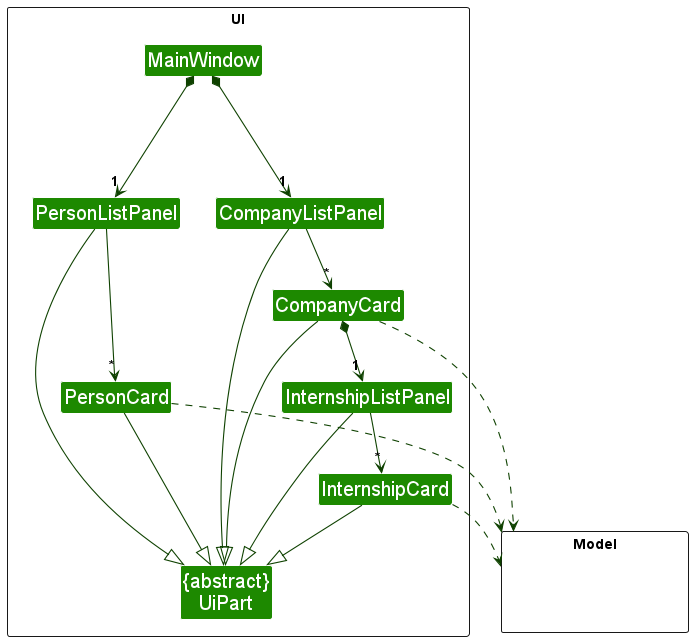

The `PersonListPanel` and the `CompanyListPanel` are each made up of different parts, as illustrated in the class diagram
above. 

The `UI` component uses the JavaFx UI framework. The layout of these UI parts are defined in matching `.fxml` files that
are in the `src/main/resources/view` folder. For example, the layout of
the [`MainWindow`](https://github.com/AY2324S1-CS2103T-T10-4/tp/tree/master/src/main/java/seedu/address/ui/MainWindow.java)
is specified
in [`MainWindow.fxml`](https://github.com/AY2324S1-CS2103T-T10-4/tp/tree/master/src/main/resources/view/MainWindow.fxml).

The `UI` component,

* executes user commands using the `Logic` component.
* listens for changes to `Model` data so that the UI can be updated with the modified data.
* keeps a reference to the `Logic` component, because the `UI` relies on the `Logic` to execute commands.
* depends on some classes in the `Model` component, as it displays `Person` and `Company` objects residing in the `Model`.

### Logic component

**API
** : [`Logic.java`](https://github.com/AY2324S1-CS2103T-T10-4/tp/tree/master/src/main/java/seedu/address/logic/Logic.java)

Here's a (partial) class diagram of the entire `Logic` component:

The sequence diagram below illustrates the interactions within the `Logic` component,
taking `execute("delete p 1")` API call as an example.

The command `delete p 1` deletes the first person listed in the list of people in the addressbook.

:information_source: **Note:** The lifeline for `DeleteCommandParser` should end at the destroy marker (X) but due to a limitation of PlantUML, the lifeline reaches the end of diagram.

How the `Logic` component works:

1. When `Logic` is called upon to execute a command, it is passed to an `AddressBookParser` object which in turn creates
   a parser that matches the command (e.g., `DeleteCommandParser`) and uses it to parse the command.
2. This results in a `Command` object (more precisely, an object of one of its subclasses 
   e.g., `DeletePersonCommand` / `DeleteCompanyCommand` / `DeleteInternshipCommand` depending on the entity targeted),
   which is executed by the `LogicManager`.
3. The command can communicate with the `Model` when it is executed (e.g. to delete a person).
4. The result of the command execution is encapsulated as a `CommandResult` object which is returned back from `Logic`.

Here are the other classes in `Logic` (omitted from the class diagram above) that are used for parsing a user command:

How the parsing works:

* When called upon to parse a user command, the `AddressBookParser` class creates an `XYZCommandParser` (`XYZ` is a
  placeholder for the specific command name e.g., `DeleteCommandParser`) which uses the other classes shown above to
  parse the user command and create a `XYZCommand` object (e.g., `DeleteCommand`) which the `AddressBookParser` returns
  back as a `Command` object.
* All `XYZCommandParser` classes (e.g., `AddCommandParser`, `DeleteCommandParser`, ...) inherit from the `Parser`
  interface so that they can be treated similarly where possible e.g, during testing.

Due to our two main entities (`Person` and `Company`) having similar commands (e.g. Delete, Find, Add...), there are
packages for such commands to improve abstraction.
In these packages (e.g. deletecommand, findcommand packages), we can find the class `XYZCommand` that is created
by `XYZCommandParser`.

How `XYZCommandParser` works:

* When called upon to parse a command argument (e.g. `p 1` in `delete p 1`), it determines whether the argument wants to
  work with a `Person` entity, a `Company` entity or an `Internship` entity. This is often determined by `p`, `c` or `i` (e.g. `delete p 1` deletes the
  first person, `delete c 1` deletes the first company).
* `XYZCommandParser` then returns the appropriate `XYZCommand` class. For people, this is `XYZPersonCommand`, and for
  companies, `XYZCompanyCommand`.

### Model component

**API
** : [`Model.java`](https://github.com/AY2324S1-CS2103T-T10-4/tp/tree/master/src/main/java/seedu/address/model/Model.java)

Here's a (partial) class diagram of the entire `Model` component:

The `Model` component,

* stores the address book data i.e., all `Person` objects (which are contained in a `UniquePersonList` object), and
  all `Company` objects (which are contained in a `UniqueCompanyList` object)
* stores the currently 'selected' `Person` or `Company` objects (e.g., results of a search query) as a separate
  _filtered_ list which is exposed to outsiders as an unmodifiable `ObservableList<Person>` or `ObservableList<Company>`
  respectively that can be 'observed' e.g. the UI can be bound to this list so that the UI automatically updates when
  the data in the list change.
* stores a `UserPref` object that represents the user’s preferences. This is exposed to the outside as
  a `ReadOnlyUserPref` objects.
* does not depend on any of the other three components (as the `Model` represents data entities of the domain, they
  should make sense on their own without depending on other components)

`Model` has 2 main packages: persons and companies. (`Person` and `Company` class details omitted from the class diagram
above)

The details of the `Person` class is shown below:

The details of the `Company` class is shown below:

The `Company` class:
* stores all the data about its internships i.e., all `Internship` objects for that company in the `UniqueInternshipList`.
  All operations regarding `Internship` objects for the company operates upon this `UniqueInternshipList`.
* stores the sorted and filtered `Internship` objects as a separate _filtered_ and _sorted_ list which is exposed to outsiders as an unmodifiable `ObservableList<Internship>`. 
  This allows for further expansion of internship-related commands to filtering and other forms of internship sorting.

### Storage component

**API
** : [`Storage.java`](https://github.com/AY2324S1-CS2103T-T10-4/tp/tree/master/src/main/java/seedu/address/storage/Storage.java)

The `Storage` component,

* can save both address book data and user preference data in JSON format, and read them back into corresponding
  objects.
* inherits from both `AddressBookStorage` and `UserPrefStorage`, which means it can be treated as either one (if only
  the functionality of only one is needed).
* depends on some classes in the `Model` component (because the `Storage` component's job is to save/retrieve objects
  that belong to the `Model`)

### Common classes

Classes used by multiple components are in the `seedu.addressbook.commons` package.

#### The `AppUtil` class:

is a container for App specific utility functions.

#### The `CollectionUtil` class:

contains utility methods related to Collections.

#### The `ConfigUtil` class:

a class for accessing the Config File.

#### The `DateTimeParserUtil` class:

handles all the parsing of Strings into LocalDateTime objects, and vice versa. The format of the String is determined by
the final static variables `DATE_FORMAT` and `TIME_FORMAT`.

#### The `FileUtil` class:

writes and reads files.

#### The `JsonUtil` class:

converts a Java object instance to JSON and vice versa.

#### The `StringUtil` class:

contains helper functions for handling strings.

#### The `ToStringBuilder` class:

builds a string representation of an object.

--------------------------------------------------------------------------------------------------------------------

## **Implementation**

This section describes some noteworthy details on how certain features are implemented.

### \[V1.3\] Improved find feature for person and company

#### Implementation

The `FindPersonCommand` is implemented as follows:

* The `LogicManager`'s execute method is called with the command string.
* The `LogicManager` calls the `parseCommand()` method of the `AddressBookParser` class.
* The `AddressBookParser` creates a `FindCommandParser` which parses the user input and returns a `FindPersonCommand`
  object.
* The `FindPersonParser` is implemented as follows:
    * It uses the `ArgumentMultimap` class to parse the user input into a `Map` of keywords and tags.
    * It uses the `NameAndTagContainKeywordsPredicate` class to create a `Predicate` object that can be used to filter
      the list of persons.
    * It returns a `FindPersonCommand` object containing the `Predicate` object.
* The `FindPersonCommand` object is executed by the `LogicManager`.
* The `FindPersonCommand` communicate with the `Model` to filter the list of persons using the `Predicate` object.
* The `FindPersonCommand` creates a `CommandResult` object containing the filtered list of persons and returns it to
  the `LogicManager`.
* The `LogicManager` passes the `CommandResult` object to the `Ui` which displays the filtered list of persons.

The `FindCompanyCommand` is implemented similarly.

#### Sequence diagram

#### Design Considerations

When refining the `FindPersonCommand` and `FindCompanyCommand`, careful thought was given to ensure that the
implementation was consistent with the existing command structure. Key considerations included:

* **Consistency with Existing Patterns**: The commands follow the established patterns of the application, ensuring that
  the new feature integrates smoothly with the existing codebase.

* **Command Differentiation**: The distinction between finding a person and a company is made in the `FindCommandParser`
  to minimize complexity in the `AddressBookParser`. This maintains the simplicity and single-responsibility of
  the `AddressBookParser`.

* **Separate Command Classes**: Separate classes for `FindPersonCommand` and `FindCompanyCommand` were chosen over a
  unified `FindCommand` to keep the predicate handling specific and clear, avoiding a single class becoming overly
  complex by handling multiple object types.

#### Alternatives Considered

* **Unified `FindCommand` Class**: A single `FindCommand` class handling both persons and companies was considered to
  promote code reuse. The downside to this approach would be reduced readability and increased complexity within the
  class, as it would need to conditionally handle two different data types.

* **Parsing at `AddressBookParser` Level**: Moving the differentiation logic to the `AddressBookParser` class was
  another alternative. This was rejected to avoid overcomplicating a class that should remain streamlined for parsing a
  variety of commands.

### \[V1.3\] View a single contact feature

The `ViewPersonCommand` is implemented as follows:

* The `LogicManager`'s execute method is called with the command string.
* The `LogicManager` calls the `parseCommand()` method of the `AddressBookParser` class.
* The `AddressBookParser` creates a `ViewCommandParser` which parses the user input and returns the `ViewPersonCommand`
  object.
* The `ViewCommandParser` is implemented as follows:
    * It parses the index using the `parseIndex` method from the `ParserUtil` which is stored in the `Index` object.
    * It returns the `ViewPersonCommand` object containing the `Index` object.
* The `ViewPersonCommand` object is executed by the `LogicManager`.
* The `ViewPersonCommand` communicates with the `Model` to retrieve the last shown list of persons.
* The `ViewPersonCommand` retrieves the `Person` object from the list of persons using the `Index` object.
* The `ViewPersonCommand` creates a `CommandResult` object containing the `Person` object and returns it to the
  `LogicManager`.
* The `LogicManager` passes the `CommandResult` object to the `Ui` which displays the `Person` object.

The `ViewCompanyCommand` is implemented similarly.

#### Sequence diagram

#### Design considerations

* The implementation follows the pattern of the existing commands as far as possible.
* The differentiation between the `ViewPersonCommand` and `ViewCompanyCommand` is done in the `ViewCommandParser` class
  instead of `AddressBookParser` class as we want to keep the `AddressBookParser` class simple. This also maintains the
  SLAP principle.
* The `ViewPersonCommand` and `ViewCompanyCommand` are implemented as separate classes instead of a single `ViewCommand`
  class to allow for easy extension for other types of contact objects.

#### Alternatives considered

* Implementing the `ViewPersonCommand` and `ViewCompanyCommand` as a single `ViewCommand` class would enable for more
  code reuse. However, this would make the `ViewCommand` too complex and difficult-to-read as it would have to account
  for both `Person` and `Company` objects. This complexity will only increase if other types of contact objects are
  introduced.
* An alternative is to differentiate between the `ViewPersonCommand` and `ViewCompanyCommand` in the `AddressBookParser`
  class. However, such implementation will make the `AddressBookParser` class more complex and difficult to maintain.
* Another alternative is implementing `ViewPersonCommand` and `ViewCompanyCommand` as a type of `ListCommand` as they
  are both related to the listing of contacts. However, this would limit the type of information that can be shown by
  the `View` commands as they would use the same list as the `List` commands.

### \[V1.4\] Sort company list feature

The `SortCompanyCommand` is implemented as follows:

* The `LogicManager`'s execute method is called with the command string.
* The `LogicManager` calls the `parseCommand()` method of the `AddressBookParser` class.
* The `AddressBookParser` creates a `SortCommandParser` which parses the user input and returns the `SortCompanyCommand`
  object.
* The `SortCommandParser` is implemented as follows:
    * It calls the `parseSortInterval` method from the `ParserUtil` to get the start and end time of the sort interval.
    * It returns the `SortCompanyCommand` object containing the start and end time of the sort interval.
* The `SortCompanyCommand` object is executed by the `LogicManager`.
* The `SortCompanyCommand` communicates with the `Model` by passing the start and end time to retrieve the list of
  companies.
* The `ModelManager` create a `CompanyDateRangePredicate` and a `CompanyDateComparator` object using the start and end
  time of
  the sort interval.
* The `ModelManager` filters the list of companies using the `CompanyDateRangePredicate` object.
* The `ModelManager` sorts the filtered list of companies using the `CompanyDateComparator` object.
* The `SortCompanyCommand` creates a `CommandResult` object containing the sorted list of companies and returns it to
  the `LogicManager`.
* The `LogicManager` passes the `CommandResult` object to the `Ui` which displays the sorted list of companies.

#### Sequence diagram

#### Design Considerations

When implementing the `SortCompanyCommand`, several design considerations were taken into account:

* **Separation of Concerns**: The parsing of the command and the execution logic are kept separate. Parsing is handled
  by `AddressBookParser` and `SortCommandParser`, while execution is managed by `LogicManager` and `ModelManager`. This
  ensures that each class is responsible for a single aspect of the command's operation, aligning with the Single
  Responsibility Principle.

* **Command Object Pattern**: By encapsulating the sorting operation within a `SortCompanyCommand` object, we can easily
  extend or modify the sorting behavior without affecting other parts of the system.

* **Use of Comparators and Predicates**: Using the `CompanyDateRangePredicate` and `CompanyDateComparator` allows for a
  clean and reusable way to filter and sort the list of companies, respectively. It provides flexibility if additional
  sorting criteria are required in the future.

* **Model-Driven Sorting**: Placing the logic of sorting within the model (`ModelManager`) rather than the command
  object emphasizes that the model is the source of truth for data manipulation and business logic.

#### Alternatives Considered

* **Sorting in the Command Object**: Initially, sorting could have been implemented directly in
  the `SortCompanyCommand`. However, this was rejected to keep the command object simple and to maintain the integrity
  of the model as the primary handler of data operations.

* **Static Utility Methods**: Rather than creating comparator and predicate objects, static utility methods could have
  been used for sorting and filtering. This approach was discarded because it would be less flexible and would not allow
  for easy adjustments or extensions of sorting criteria.

* **In-memory vs Database Sorting**: Deciding where to perform the sorting operation—whether in memory or through a
  database query—was an important consideration. In-memory sorting was chosen for its simplicity and because it does not
  require additional database support, but for larger datasets, database-level sorting might be more efficient.

[//]: # (### \[Proposed\] Undo/redo feature)

[//]: # ()

[//]: # (#### Proposed Implementation)

[//]: # ()

[//]: # (The proposed undo/redo mechanism is facilitated by `VersionedAddressBook`. It extends `AddressBook` with an undo/redo)

[//]: # (history, stored internally as an `addressBookStateList` and `currentStatePointer`. Additionally, it implements the)

[//]: # (following operations:)

[//]: # ()

[//]: # (* `VersionedAddressBook#commit&#40;&#41;`— Saves the current address book state in its history.)

[//]: # (* `VersionedAddressBook#undo&#40;&#41;`— Restores the previous address book state from its history.)

[//]: # (* `VersionedAddressBook#redo&#40;&#41;`— Restores a previously undone address book state from its history.)

[//]: # ()

[//]: # (These operations are exposed in the `Model` interface as `Model#commitAddressBook&#40;&#41;`, `Model#undoAddressBook&#40;&#41;`)

[//]: # (and `Model#redoAddressBook&#40;&#41;` respectively.)

[//]: # ()

[//]: # (Given below is an example usage scenario and how the undo/redo mechanism behaves at each step.)

[//]: # ()

[//]: # (Step 1. The user launches the application for the first time. The `VersionedAddressBook` will be initialized with the)

[//]: # (initial address book state, and the `currentStatePointer` pointing to that single address book state.)

[//]: # ()

[//]: # (![UndoRedoState0]&#40;images/UndoRedoState0.png&#41;)

[//]: # ()

[//]: # (Step 2. The user executes `delete 5` command to delete the 5th person in the address book. The `delete` command)

[//]: # (calls `Model#commitAddressBook&#40;&#41;`, causing the modified state of the address book after the `delete 5` command executes)

[//]: # (to be saved in the `addressBookStateList`, and the `currentStatePointer` is shifted to the newly inserted address book)

[//]: # (state.)

[//]: # ()

[//]: # (![UndoRedoState1]&#40;images/UndoRedoState1.png&#41;)

[//]: # ()

[//]: # (Step 3. The user executes `add n/David …​` to add a new person. The `add` command also)

[//]: # (calls `Model#commitAddressBook&#40;&#41;`, causing another modified address book state to be saved into)

[//]: # (the `addressBookStateList`.)

[//]: # ()

[//]: # (![UndoRedoState2]&#40;images/UndoRedoState2.png&#41;)

[//]: # ()

[//]: # (
:information_source: **Note:** If a command fails its execution, it will not call `Model#commitAddressBook&#40;&#41;`, so the address book state will not be saved into the `addressBookStateList`.)

[//]: # ()

[//]: # (
)

[//]: # ()

[//]: # (Step 4. The user now decides that adding the person was a mistake, and decides to undo that action by executing)

[//]: # (the `undo` command. The `undo` command will call `Model#undoAddressBook&#40;&#41;`, which will shift the `currentStatePointer`)

[//]: # (once to the left, pointing it to the previous address book state, and restores the address book to that state.)

[//]: # ()

[//]: # (![UndoRedoState3]&#40;images/UndoRedoState3.png&#41;)

[//]: # ()

[//]: # (
:information_source: **Note:** If the `currentStatePointer` is at index 0, pointing to the initial AddressBook state, then there are no previous AddressBook states to restore. The `undo` command uses `Model#canUndoAddressBook&#40;&#41;` to check if this is the case. If so, it will return an error to the user rather)

[//]: # (than attempting to perform the undo.)

[//]: # ()

[//]: # (
)

[//]: # ()

[//]: # (The following sequence diagram shows how the undo operation works:)

[//]: # ()

[//]: # (![UndoSequenceDiagram]&#40;images/UndoSequenceDiagram.png&#41;)

[//]: # ()

[//]: # (
:information_source: **Note:** The lifeline for `UndoCommand` should end at the destroy marker &#40;X&#41; but due to a limitation of PlantUML, the lifeline reaches the end of diagram.)

[//]: # ()

[//]: # (
)

[//]: # ()

[//]: # (The `redo` command does the opposite — it calls `Model#redoAddressBook&#40;&#41;`, which shifts the `currentStatePointer` once)

[//]: # (to the right, pointing to the previously undone state, and restores the address book to that state.)

[//]: # ()

[//]: # (
:information_source: **Note:** If the `currentStatePointer` is at index `addressBookStateList.size&#40;&#41; - 1`, pointing to the latest address book state, then there are no undone AddressBook states to restore. The `redo` command uses `Model#canRedoAddressBook&#40;&#41;` to check if this is the case. If so, it will return an error to the user rather than attempting to perform the redo.)

[//]: # ()

[//]: # (
)

[//]: # ()

[//]: # (Step 5. The user then decides to execute the command `list`. Commands that do not modify the address book, such)

[//]: # (as `list`, will usually not call `Model#commitAddressBook&#40;&#41;`, `Model#undoAddressBook&#40;&#41;` or `Model#redoAddressBook&#40;&#41;`.)

[//]: # (Thus, the `addressBookStateList` remains unchanged.)

[//]: # ()

[//]: # (![UndoRedoState4]&#40;images/UndoRedoState4.png&#41;)

[//]: # ()

[//]: # (Step 6. The user executes `clear`, which calls `Model#commitAddressBook&#40;&#41;`. Since the `currentStatePointer` is not)

[//]: # (pointing at the end of the `addressBookStateList`, all address book states after the `currentStatePointer` will be)

[//]: # (purged. Reason: It no longer makes sense to redo the `add n/David …​` command. This is the behavior that most modern)

[//]: # (desktop applications follow.)

[//]: # ()

[//]: # (![UndoRedoState5]&#40;images/UndoRedoState5.png&#41;)

[//]: # ()

[//]: # (The following activity diagram summarizes what happens when a user executes a new command:)

[//]: # ()

[//]: # ()

[//]: # ()

[//]: # (#### Design considerations:)

[//]: # ()

[//]: # (**Aspect: How undo & redo executes:**)

[//]: # ()

[//]: # (* **Alternative 1 &#40;current choice&#41;:** Saves the entire address book.)

[//]: # (    * Pros: Easy to implement.)

[//]: # (    * Cons: May have performance issues in terms of memory usage.)

[//]: # ()

[//]: # (* **Alternative 2:** Individual command knows how to undo/redo by)

[//]: # (  itself.)

[//]: # (    * Pros: Will use less memory &#40;e.g. for `delete`, just save the person being deleted&#41;.)

[//]: # (    * Cons: We must ensure that the implementation of each individual command are correct.)

[//]: # ()

[//]: # (_{more aspects and alternatives to be added}_)

[//]: # ()

[//]: # (### \[Proposed\] Data archiving)

[//]: # ()

[//]: # (_{Explain here how the data archiving feature will be implemented}_)

--------------------------------------------------------------------------------------------------------------------

## **Documentation, logging, testing, configuration, dev-ops**

* [Documentation guide](Documentation.md)
* [Testing guide](Testing.md)
* [Logging guide](Logging.md)
* [Configuration guide](Configuration.md)
* [DevOps guide](DevOps.md)

--------------------------------------------------------------------------------------------------------------------

## **Appendix: Requirements**

### Product scope

**Target user profile**:

* majors in Computing at NUS
* searching for job opportunities or internships
* prefers swift and organized tracking for application processes
* prefers desktop apps for managing applications and contacts

**Value proposition**: Efficiently manage job and internship applications and vital contacts with clear timelines using
a desktop app.

### User stories

Priorities: High (must have) - `* * *`, Medium (nice to have) - `* *`, Low (unlikely to have) - `*`

| Priority | As a …​                                           | I want to …​                                         | So that I can…​                                                             |
|----------|---------------------------------------------------|------------------------------------------------------|-----------------------------------------------------------------------------|
| `* * *`  | CS student at NUS                                 | add person contacts with details                     | create a comprehensive network of contacts for academic and career purposes |
| `* * *`  | CS student at NUS                                 | add company contacts with details                    | track and manage potential job and internship opportunities                |
| `* * *`  | CS student at NUS                                 | view all my contacts, including persons and companies | easily access and manage my network and opportunities                      |
| `* * *`  | CS student at NUS                                 | delete person contacts from my list                  | keep my network current and focused on relevant connections                |
| `* * *`  | CS student at NUS                                 | delete company contacts from my list                 | focus on companies and opportunities that are most relevant to me          |
| `* * *`  | CS student at NUS                                 | edit details of person contacts                      | update information as my network evolves and changes                       |
| `* * *`  | CS student at NUS                                 | edit details of company contacts                     | keep track of changes in company details and opportunities                 |
| `* * *`  | CS student at NUS                                 | add internships to company contacts                  | organize and track my internship applications with specific companies      |
| `* * *`  | CS student at NUS                                 | delete internships from company contacts             | focus on current and relevant internship opportunities                     |
| `* * *`  | CS student at NUS                                 | view details of specific persons or companies        | access detailed information quickly for networking or application purposes|
| `* * *`  | CS student at NUS                                 | find people or companies using search criteria       | locate specific contacts or companies efficiently                         |
| `* * *`  | CS student at NUS                                 | sort companies based on upcoming internship dates    | prioritize my preparation and application process                         |
| `* *`    | CS student frequently attending networking events | tag my contacts                                      | easily differentiate between various types of contacts                     |

These user stories now better reflect the functionalities and processes described in your use cases. They provide a clear and concise description of the system's capabilities from the perspective of a Computer Science student at NUS, focusing on managing contacts, companies, and internship opportunities.

### Use cases:

For all use cases below, we assume:

**Software System:** SOCareers
**Actors:** User

---

#### Use Case: UC01 - Viewing the User Guide

**Preconditions:** User has the SOCareers open.  
**Guarantees:** A link to the user guide will provided to the user.  
**MSS:**
1. User requests for help.
2. SOCareers displays a pop-up box with a link to the user guide.

    Use case ends.

---

#### Use Case: UC02 - Adding a Person

**Preconditions:** User has the SOCareers open.
**Guarantees:** A new person is added to the user’s list of people with the provided details.  
**MSS:**
1. User requests to add a person contact and provides the person's details.
2. SOCareers adds the person to the list of people and confirms to the user that the operation was completed successfully.

    Use case ends.

**Extensions:**
- 1a. The provided information is invalid (e.g., invalid phone number format, invalid email format, duplicate person name, etc.).
  - 1a1. SOCareers displays an error message.

    Use case resumes from step 1.

---

#### Use Case: UC03 - Adding a Company

**Preconditions:** User has the SOCareers open.
**Guarantees:** A new company is added to the user’s list of companies with the provided details.  
**MSS:**
1. User requests to add a company contact and provides the company's details.
2. SOCareers adds the company to the list of companies and confirms to the user that the operation was completed successfully.

    Use case ends.

**Extensions:**
- 1a. The provided information is invalid (e.g., invalid phone number format, invalid email format, duplicate company name, etc.).
  - 1a1. SOCareers displays an error message.

    Use case resumes from step 1.

---

#### Use Case: UC04 - Adding an Internship to a Company Contact

**Preconditions:** User has the SOCareers open and has at least one company in their list of companies.
**Guarantees:** A new internship is added to the specified company’s internships list with the provided details.  
**MSS:**
1. User requests to add an internship to a company contact and provides the internship's details.
2. SOCareers adds the internship to the specified company's list of internships and confirms to the user that the operation was completed successfully.

    Use case ends.

**Extensions:**
- 1a. The provided information is invalid (e.g., invalid company to add to, invalid datetime, etc.).
  - 1a1. SOCareers displays an error message.

    Use case resumes from step 1.

---

#### Use Case: UC05 - Listing All Persons

**Preconditions:** User has the SOCareers open.
**Guarantees:** An unfiltered list of persons in the user's contacts is displayed.  
**MSS:**
1. User requests to list all persons.
2. SOCareers displays a list of all persons in the list of people.

    Use case ends.

**Extensions:**
- 1a. There is an error in the command format (e.g., invalid parameters, etc.).
  - 1a1. SOCareers displays an error message.

    Use case resumes from step 1.

---

#### Use Case: UC06 - Listing All Companies

**Preconditions:** User has the SOCareers open.
**Guarantees:** An unfiltere of companies in the user's contacts is displayed.
**MSS:**
1. User requests to list all companies.
2. SOCareers displays a list of all companies in the list of companies.

    Use case ends.

**Extensions:**
- 1a. There is an error in the command format (e.g., invalid parameters, etc.).
  - 1a1. SOCareers displays an error message.

    Use case resumes from step 1.

---

#### Use Case: UC07 - Deleting a Person

**Preconditions:** User has the SOCareers open and has at least one person in the list of people.
**Guarantees:** The specified person is deleted from the list of people.

**MSS:**
1. User requests to delete a person.
2. SOCareers deletes the specified person from the list of people and confirms to the user that the operation was completed successfully.

    Use case ends.

**Extensions:**
- 1a. The specified person does not exist in the list of people.
  - 1a1. SOCareers displays an error message.

    Use case resumes from step 1.

---

#### Use Case: UC08 - Deleting a Company

**Preconditions:** User has the SOCareers open and has at least one company in the list of companies.
**Guarantees:** The specified company is deleted from the list of companies.

**MSS:**
1. User requests to delete a company.
2. SOCareers deletes the specified company from the list of companies and confirms to the user that the operation was completed successfully.

    Use case ends.

**Extensions:**
- 1a. The specified company does not exist in the list of companies.
  - 1a1. SOCareers displays an error message.

    Use case resumes from step 1.

---

#### Use Case: UC09 - Deleting an Internship

**Preconditions:** User has the SOCareers open and has added at least one company that has at least one internship.
**Guarantees:** The specified internship is deleted from the specified company's list of internships.

**MSS:**
1. User requests to delete an internship.
2. SOCareers deletes the specified internship from the specified company's list of internships and confirms to the user that the operation was completed successfully.

    Use case ends.

**Extensions:**
- 1a. The specified company does not exist in the list of companies.
  - 1a1. SOCareers displays an error message.

    Use case resumes from step 1.

- 1b. The specified internship does not exist in the specified company's list of internships.
  - 1b1. SOCareers displays an error message.

    Use case resumes from step 1.

---

#### Use Case: UC10 - Viewing a Person

**Preconditions:** User has the SOCareers open and has at least one person in the list of people.
**Guarantees:** The specified person's details are displayed.

**MSS:**
1. User requests to view a person.
2. SOCareers displays the specified person's details.

    Use case ends.

**Extensions:**
- 1a. The specified person does not exist in the list of people.
  - 1a1. SOCareers displays an error message.

    Use case resumes from step 1.

---

#### Use Case: UC11 - Viewing a Company

**Preconditions:** User has the SOCareers open and has at least one company in the list of companies.
**Guarantees:** The specified company's details are displayed.

**MSS:**
1. User requests to view a company.
2. SOCareers displays the specified company's details.

    Use case ends.

**Extensions:**
- 1a. The specified company does not exist in the list of companies.
  - 1a1. SOCareers displays an error message.

    Use case resumes from step 1.

---

#### Use Case: UC12 - Editing a Person

**Preconditions:** User has the SOCareers open and has at least one person in the list of people.
**Guarantees:** The specified person's details are updated with the provided details.

**MSS:**
1. User requests to edit a person.
2. SOCareers updates the specified person's details with the provided details and confirms to the user that the operation was completed successfully.

    Use case ends.

**Extensions:**
- 1a. The specified person does not exist in the list of people.
  - 1a1. SOCareers displays an error message.

    Use case resumes from step 1.
- 1b. The provided information is invalid (e.g., invalid phone number format, invalid email format, etc.).
  - 1b1. SOCareers displays an error message.

    Use case resumes from step 1.

---

#### Use Case: UC13 - Editing a Company

**Preconditions:** User has the SOCareers open and has at least one company in the list of companies.
**Guarantees:** The specified company's details are updated with the provided details.

**MSS:**
1. User requests to edit a company.
2. SOCareers updates the specified company's details with the provided details and confirms to the user that the operation was completed successfully.

    Use case ends.

**Extensions:**
- 1a. The specified company does not exist in the list of companies.
  - 1a1. SOCareers displays an error message.

    Use case resumes from step 1.
  - 1b. The provided information is invalid (e.g., invalid phone number format, invalid email format, etc.).
    - 1b1. SOCareers displays an error message.

      Use case resumes from step 1.

---

#### Use Case: UC14 - Editing an Internship

**Preconditions:** User has the SOCareers open and has added at least one company that has at least one internship.
**Guarantees:** The specified internship's details are updated with the provided details.

**MSS:**
1. User requests to edit an internship.
2. SOCareers updates the specified internship's details with the provided details and confirms to the user that the operation was completed successfully.

    Use case ends.

**Extensions:**
- 1a. The specified company does not exist in the list of companies.
  - 1a1. SOCareers displays an error message.

    Use case resumes from step 1.
- 1b. The specified internship does not exist in the specified company's list of internships.
  - 1b1. SOCareers displays an error message.

      Use case resumes from step 1.
- 1c. The provided information is invalid (e.g., invalid datetime, etc.).
  - 1c1. SOCareers displays an error message.

      Use case resumes from step 1.

---

#### Use Case: UC15 - Finding People

**Preconditions:** User has the SOCareers open.
**Guarantees:** The people that match the search criteria are displayed.

**MSS:**
1. User requests to find a person with name or tag keywords.
2. SOCareers finds the persons with provided information and displays the list of persons that match the search criteria.

    Use case ends.

**Extensions:**
- 1a. The provided information is invalid (e.g., search keyword is empty, etc.).
  - 1a1. SOCareers displays an error message.

    Use case resumes from step 1.

---

#### Use Case: UC16 - Finding Companies

**Preconditions:** User has the SOCareers open.
**Guarantees:** The companies that match the search criteria are displayed.

**MSS:**
1. User requests to find a company with name or tag keywords.
2. SOCareers finds the companies with provided information and displays the list of companies that match the search criteria.

    Use case ends.

**Extensions:**
- 1a. The provided information is invalid (e.g., search keyword is empty, etc.).
  - 1a1. SOCareers displays an error message.

    Use case resumes from step 1.

---

#### Use Case: UC17 - Sorting Companies

**Preconditions:** User has the SOCareers open.
**Guarantees:** The companies are sorted in increasing order based on how soon their internship interviews are scheduled.

**MSS:**
1. User requests to sort companies with optional search range.
2. SOCareers organizes companies with scheduled interviews within the specified search range by the proximity of their internship interview dates.

    Use case ends.

**Extensions:**
- 1a. The provided information is invalid (e.g., datetime invalid, etc.).
  - 1a1. SOCareers displays an error message.

    Use case resumes from step 1.

---

### Non-Functional Requirements

1. Should work on standard student laptops and desktops with `Java 11` running on Windows, Linux, or MacOS.
2. Should be able to manage up to 1000 contacts without degradation in performance.
3. A user who is not proficient in tech should be able to use all functionalities within 3 clicks and 1 command.
4. A user with above average typing speed for regular English text should be able to accomplish most of the tasks faster using commands than using the mouse.
5. Should be designed for a single user.
6. Data should be stored locally in a human-readable and editable text file.
7. Data should persist across usage sessions.
8. Application should not require internet connection to run.
9. GUI should work well for display resolutions of 960x540 and higher, and for screen scales of 100% and 125%.
10. Application should be packaged and delivered to user in a single JAR file under 100MB.

### Glossary

* **SOCareers**: A desktop application for NUS Computing majors to streamline their job and internship applications.
* **Contact**: A person or company of interest saved to SOCareers.
* **Entity**: A person, company, or internship of interest saved to SOCareers.
* **User**: CS majors at NUS looking for job or internship opportunities.

--------------------------------------------------------------------------------------------------------------------

## **Appendix: Instructions for Manual Testing**

Given below are instructions to test the app manually. You are recommended to run the commands in the provided sequence.

:information_source: 
**Note:** For the most recent updates on commands and features, please refer to the User Guide. The User Guide is continuously updated to reflect the latest changes and will provide you with the most current instructions and examples for using the system effectively.

:information_source: **Note:** These instructions only provide a starting point for testers to work on;
testers are expected to do more *exploratory* testing.

### Launch and shutdown

1. Initial launch

    1. Download the jar file and copy into an empty folder

    2. Run the jar file using command `java -jar SOCareers.jar`. Expected: Shows the GUI with a set of sample contacts. The window
       size may not be
       optimum, so adjust the window size to ensure all components can be seen properly.

2. Saving window preferences

    1. Resize the window to an optimum size. Move the window to a different location. Close the window.

    2. Re-launch the app by running the jar file using `java -jar` 
       Expected: The most recent window size and location is retained.

### Command Testing

#### Clearing All Data

1. To start using our product, it is recommended to clear all sample data first. To do so, type `clear` in the command box and
   press `Enter`. 
   **Expected:** The Command Result Box will display `Address book has been cleared!` and the list of people, companies and their internships
   will
   be empty.

#### Adding A Person or A Company

1. **Adding a person**
    

    :information_source:  **Note:** Specific errors will be prompted in Command Result Box for invalid fields, such
    as `Phone numbers should only contain numbers, and it should be at least 3 digits long` for incorrect phone
    entries.
    

    1. **Test case:** `add p n/Jane Lim p/81234567 e/janel@example.com a/123, Bishan St 13, #03-33` 
       **Expected:** A new contact for Jane Lim is added. Her details will be displayed in the Command Result Box.
    2. **Test
       case:** `add p n/Alan Tan p/92345678 e/alant@example.com a/456, Bukit Batok West Ave 5, #05-44 t/colleagues t/soccer` 
       **Expected:** Alan Tan's contact is added with tags, and his entry in the list of persons displays those tags.
    3. **Test
       case:** `add p n/Sarah Wong p/83456789 e/sarahw@example.com a/789, Tampines St 21, #07-77 t/colleagues t/book club` 
       **Expected:** Error message `Tags names should be alphanumeric` is shown in the Command Result Box. Tags cannot
       include spaces.
    4. **Test
       case:** `add p n/Sarah Wong p/83456789 e/sarahw@example.com a/789, Tampines St 21, #07-77 t/colleagues t/book` 
       **Expected:** Sarah Wong's contact is successfully added with the tag `book`.
    5. **Test case:** `add p n/Sarah Wong p/83456789 e/sarahw@example.com a/789, Tampines St 21, #07-77 t/colleagues t/book` 
       **Expected:** Error message `This person already exists in the address book` is shown in the Command Result Box. Duplicate contacts cannot be added.
    6. **Test case:** `add p n/Tom` 
       **Expected:** Error due to incomplete information. The Command Result Box will display `Invalid command format!...`. 

 After running both of the above commands, the Ui should look like this:
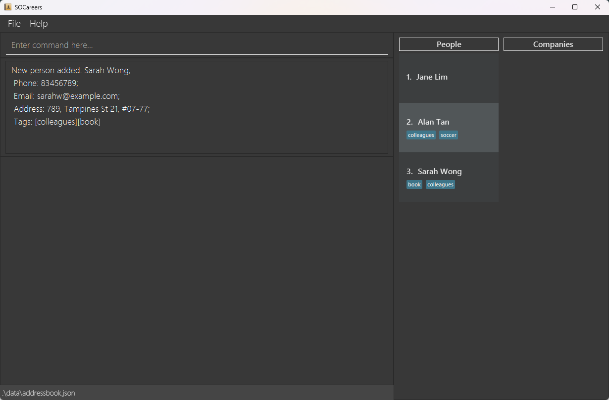

2. **Adding a company** 
    This is the parallel command to `add p`, and the constraints regarding duplicate entries are the same. The parameter constraints are also mostly similar.
    Here are some correct test cases for you to try and prepare for internship related commands.
   
    

    :information_source: **Note:** Note that compared with person, specific requirements for company fields may be different. For example, restrictions for company
    names are relaxed, and it might contain numbers as well as some punctuation marks.
    

    1. **Test case:** `add c n/RedMart p/23456789 e/redmart@example.com d/Online Grocery Store` 
       **Expected:** A new company, "RedMart" is added. Its details will be displayed in the Command Result Box.
    2. **Test case:** `add c n/Grab p/34567890 e/grab@example.com d/Transport & Delivery Services t/transportation t/socialmedia` 
       **Expected:** The company "Grab" is added with tags, and its entry in the list of companies displays those tags.
    3. **Test case:** `add c n/Shopee p/45678901 e/shopee@example.com d/E-commerce Platform t/ecommerce t/socialmedia` 
       **Expected:** The company "Shopee" is added with tags, and its entry in the list of companies displays those tags. 

 After running the above test cases, the company list should look like this:
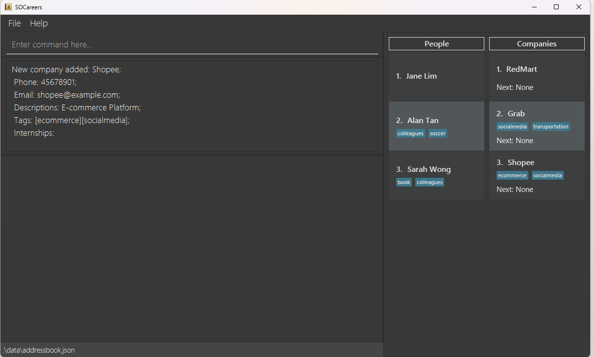

#### Listing All Persons or All Companies

1. Listing all persons
    1. **Test case:** `list p` 
       **Expected:** `Listed all persons` will be displayed in Command Result Box. All persons are shown in the List of
       People.
       Note that the list may remain unchanged if the command result is the same as the current list.
2. Listing all companies
    1. **Test case:** `list c` 
       **Expected:** `Listed all companies` will be displayed in Command Result Box. All companies are shown in the List of
       Companies.
       Note that the list may remain unchanged if the command result is the same as the current list.
3. Incorrect list commands to try: `list`, `list x` 
   **Expected:** Error message `Invalid command format!...` is shown in the Command Result Box. Two lists remain unchanged.

 After running both of the above commands, the Ui should look like this:

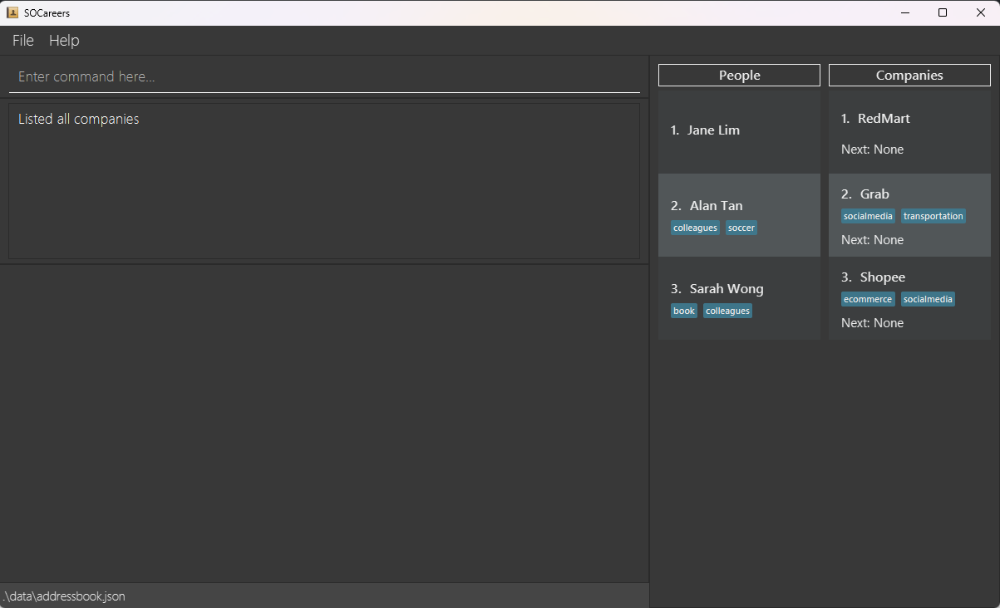

#### Editing A Person or A Company

1. Editing a person

    1. Test case: `edit p 1 n/Jannie Lim` 
       Expected: The first person's name is updated to Jannie Lim. Details of the edited person shown in the Command
       Result Box.
    2. Test case: `edit p 99 p/81234567` 
       Expected: Error message `The person index provided is invalid!` is shown in the Command Result Box.
    3. Test case: `edit p 1` 
       Expected: Error message `At least one field to edit must be provided.` is shown in the Command Result Box.

2. Editing a company

    1. Test case: `edit c 1 n/Lazada RedMart` 
       Expected: The first company's name is updated to Lazada RedMart. Details of the edited company shown in the
       Command Result Box.
    2. Test case: `edit c 99 p/81234567` 
       Expected: Error message `The company index provided is invalid!` is shown in the Command Result Box.
    3. Test case: `edit p 0 p/81234567` and `edit p -1 p/81234567` 
      Expected: Error message `Invalid command format!` is shown in the Command Result Box. In our current
      implementation, providing an non-positive index is considered giving an invalid command. This is the case for all
      commands that require an index, except for `delete` commands. We plan to enhance this in the future.
    4. Test case: `edit c 1` 
       Expected: Error message `At least one field to edit must be provided.` is shown in the Command Result Box.

 After running above commands, the Ui should look like this:

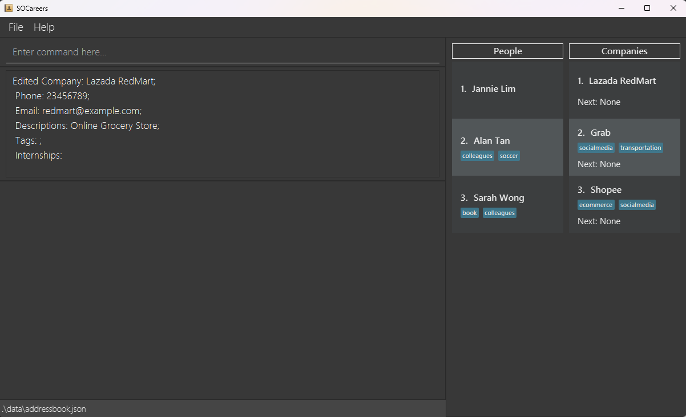

#### Adding an internship

:bulb: **Tip:** You can view the internships added later, with the `view c [COMPANY_INDEX]` command.

1. Adding an internship without a scheduled interview time
    
:information_source: 
    **Note:** Prerequisite: Have at least 1 company contact in the storage.
    

    1. **Test case:** `add i 1 n/Data Analyst Intern d/Analyze data sets to improve business decisions` 
       **Expected:** Internship is added to the first company. Details of the newly added internship are shown in the Command Result Box.

    2. **Test case:** `add i 1 n/ d/dummy` 
       **Expected:** No internship is added. An error message is shown in the Command Result Box indicating that the role name
       cannot be blank.

    3. Other incorrect add internship commands to
       try: `add i`, `add i x n/Data Analyst Intern d/Analyzing`, `add i 1 n/Intern d/`, where `x` is larger than the
       list size, or role name/description fields are blank. 
       Expected: No internship is added. Error details shown in the Command Result Box.
    
2. Adding an internship with a scheduled interview time
    
:information_source: 
    **Note:** Prerequisite: Have at least 1 company contact in the storage.
    

    1. **Test case:** `add i 2 n/Software Engineer Intern d/Work on software development projects s/15-05-2024 14:00` 
       **Expected:** Internship is added. Details of the newly added internship are shown in the Command Result Box.
       The `Next:` field
       of the company in the List of Companies will be updated to reflect the newly added internship since the scheduled
       interview time of the added internship is the next coming interview.

    2. **Test case:** `add i 2 n/Software Engineer Intern d/Work on software development projects s/15-15-2024 14:00` 
       **Expected:** No internship is added. Error message is shown in the Command Result Box, indicating that the scheduled
       interview time is invalid. Note that if the scheduled interview time is in the past, the internship will still be
       added. If the internship start date is set between the 29th and 31st in months with fewer than 31 days, the
       internship will be registered, but the start date will be automatically adjusted to the final day of that month.

    3. Other incorrect add internship commands to
       try: `add i x n/Software Engineer Intern d/Work on software development projects s/15-05-2024 14:00`, where `x`
       is larger than the list size, or role name/description fields are blank. 
       **Expected:** No internship is added. Error details shown in the Command Result Box.

#### Editing internship details

:bulb: **Tip:** You are recommended to run the command `view c [COMPANY_INDEX]` in order to view a company and its internships, before 
trying the following `edit` commands. After `edit i` is run, the company of the edited internship is automatically displayed.

:information_source: 
**Note:** Prerequisite: Company and internship lists are available.

  1. **Test case:** `add i 2 n/f d/Managing financial matters` followed
     by `view c 2` and `edit i c/2 i/2 n/Finance Intern 2024 s/20-02-2024 09:45` 
     **Expected:** The role name and scheduled interview time for the third internship of the second company in the list
     are updated. Names and descriptions of the edited internship are shown in the Command Result Box. `Next` field
     of the company in the List of Companies may be updated to reflect the newly edited internship. Note that the
     information in the display box may stay the same until updated by another command that initiate a display box update.

  2. **Test case:** `edit i c/2 i/2` without any fields to be
     updated. 
     **Expected:** No internship is edited. Error message `At least one field to edit must be provided.` is shown in the Command Result Box.
  3. Other incorrect edit commands to try: `edit i c/99 i/1 n/dummy`, `edit i c/1 i/99`, `edit i c/99 i/99` where no company
     or internship exists at the specified index. 
     **Expected:** No internship is edited. Error message `The company index provided is invalid!` is shown in the Command Result Box.

 After running above commands, the Ui should look like this:

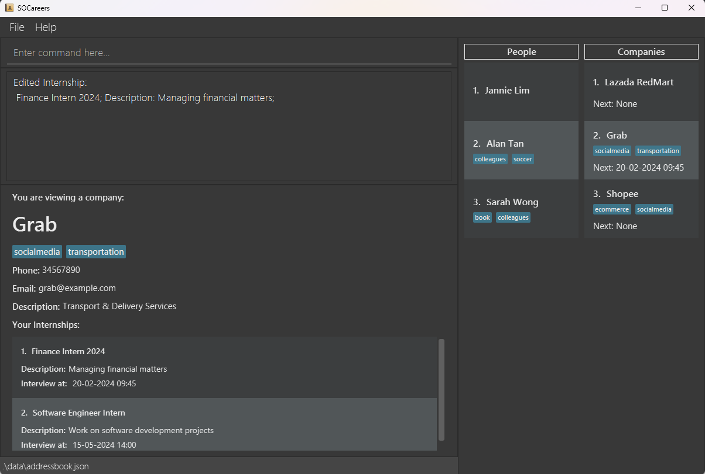
#### Viewing a Company or Person

1. Viewing details of a person's contact
    
:information_source: 
    **Note:** Prerequisite: There are people in the List of People.
    

  
    1. **Test case:** `view p 1` 
       **Expected:** First contact in the list of people is displayed in Display Box. Note that the Display Box may not be
       updated or emptied
       till the next `view` command is executed.

    2. **Test case:** `view p 0` 
       **Expected:** No contact is displayed. Error message `Invalid Command format...` is shown in the Command Result Box.

    3. Other incorrect view commands to try: `view p x`, where x is larger than the list size. 
       **Expected:** No contact is displayed. Error message `The person index provided is invalid!` is shown in the Command
       Result Box.  
    Running the `view p 1` command should result in this output in the Ui:
       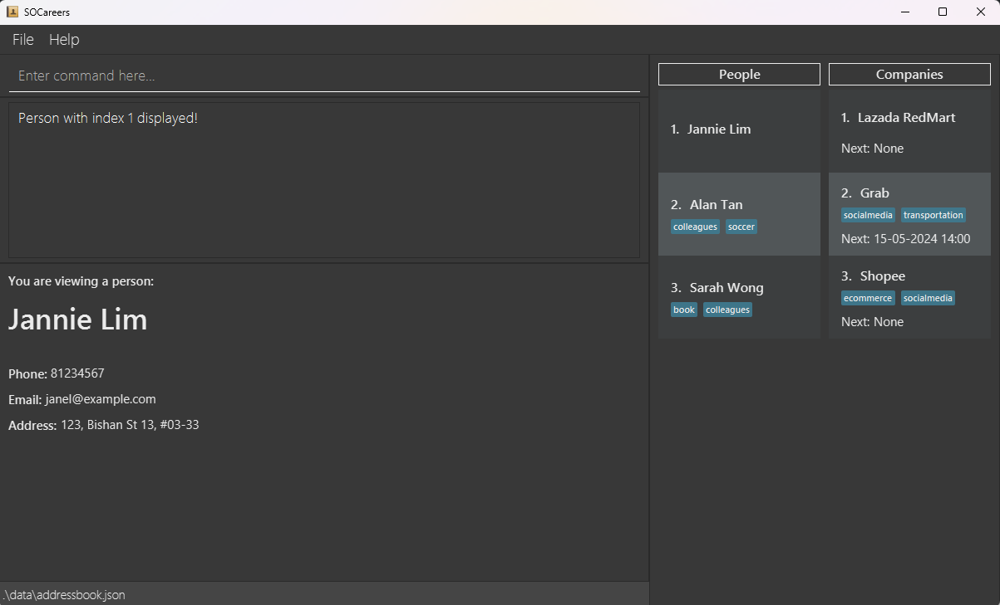

2. Viewing details of a company's contact
   
:information_source: 
    **Note:** Prerequisite: There are companies in the List of Companies.
   

   
    1. **Test case:** `view c 1` 
       Expected: First contact in the list of companies is displayed in Display Box.
    2. **Test case:** `view c 0` 
       **Expected:** No contact is displayed. Error message `Invalid Command format...` is shown in the Command Result Box.
    3. Other incorrect view commands to try: `view c x`, where x is larger than the list size. 
       **Expected:** No contact is displayed. Error message `The company index provided is invalid!` is shown in the Command
       Result Box.  
    Running the `view c 1` command should result in this output in the Ui:
       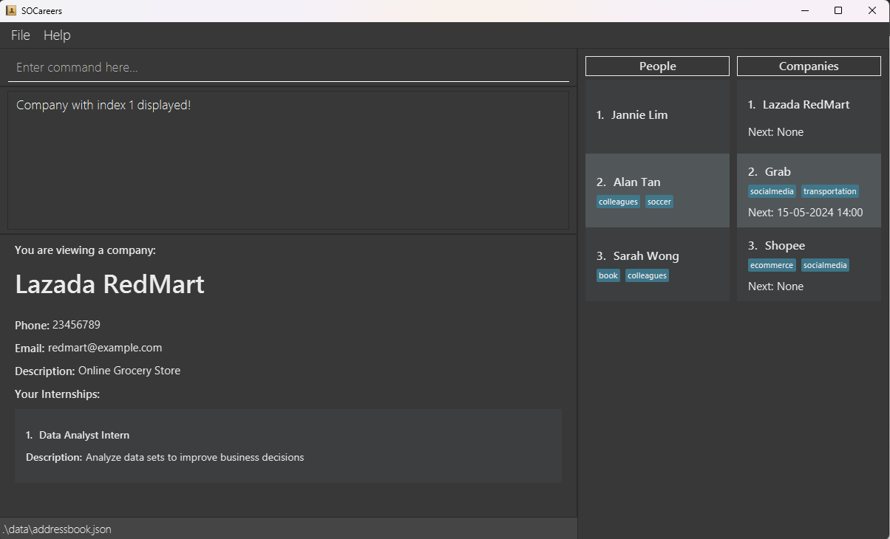
#### Finding a Person or a Company

1. Finding people in the list of people
    
:information_source: 
    **Note:** Prerequisite: There are people in the List of People.
    

 
    1. **Test case:** Assuming the tester has tried previous test cases, he or she may try `find p t/colleagues` 
       **Expected:** List of People is filtered to include only people tagged as 'colleagues'. In this case, Alan Tan and
       Sarah Wong are in the list.
       Success message is shown in the Command Result Box
    2. Other incorrect find commands to try: `find p`, `find p n/`, `find p t/` without specifying keywords. 
       **Expected:** Error message `Invalid command format!...` is shown in the Command Result Box. Planned enhancement: To
       show a more specific error message.
    3. Other incorrect find commands to try: `find p n/123numeric`, `find p t/has space` that have illegal
       arguments. 
       **Expected:** Error message `Invalid command format!...` is shown in the Command Result Box. Planned enhancement: To
       show a more specific error message.  
    Running the `find p t/colleagues` command should result in this output in the Ui. Since we assume that you are following
    this guide sequentially, the displayed company from the previous `view c` command is not cleared:
       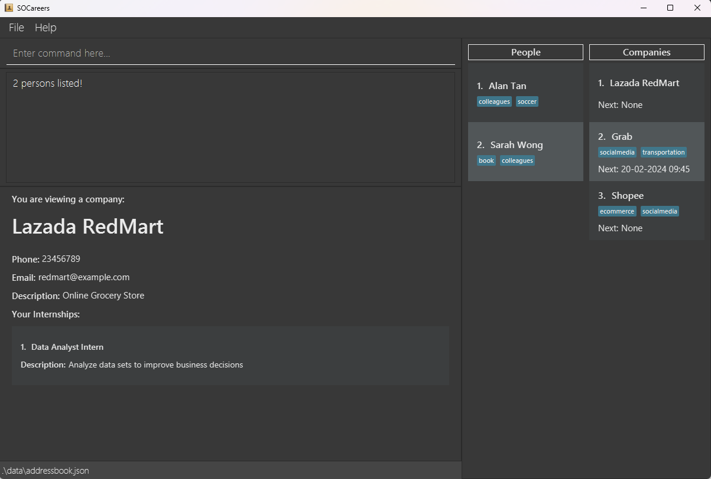

1. Finding companies in the list of companies
    
:information_source: 
    **Note:** Prerequisite: There are companies in the List of Companies.
    

    1. **Test case:** Assuming the tester has tried previous test cases, he or she may try `find c t/transportation` 
       **Expected:** List of Companies is filtered to include only companies tagged as 'transportation'. In this case, Grab
       is in the list.
       Success message is shown in the Command Result Box
    2. Other incorrect find commands to try: `find c`, `find c n/`, `find c t/` without specifying keywords. 
       **Expected:** Error message `Invalid command format!...` is shown in the Command Result Box. Planned enhancement: To
       show a more specific error message.
    3. Other incorrect find commands to try: `find c n/123numeric`, `find c t/has space` that have illegal arguments. 
       **Expected:** Error message `Invalid command format!...` is shown in the Command Result Box. Planned enhancement: To
       show a more specific error message; To allow numbers and some punctuation symbols in company name keywords.  
    Running the `find c t/transportation` command should result in this output in the Ui:
    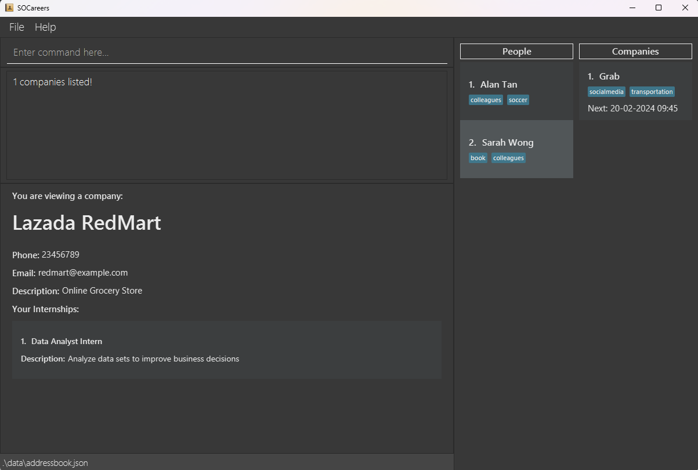

#### Sorting company list

1. Sorting companies by earliest interview in the range
    

    :bulb: **Tip:** You are encouraged to run the command `list c` in order to view all companies before running the following `sort` command,
    which sorts and filters the current list of companies being displayed.
    

    
:information_source: 
    **Note:** Prerequisite: There are companies in the List of Companies.
    

   
    1. To facilitate testing, the tester may add more
       companies and internships. If you followed the previous test cases, you may
       try `add i 3 n/Machine Learning d/Work on monetization s/29-02-2024 14:00` followed
       by `add i 3 n/Software Engineer Intern d/Work on iOS development projects s/20-05-2024 14:00` to add two
       internships to the third company in the list.  

       By now, the company list should look like this:
       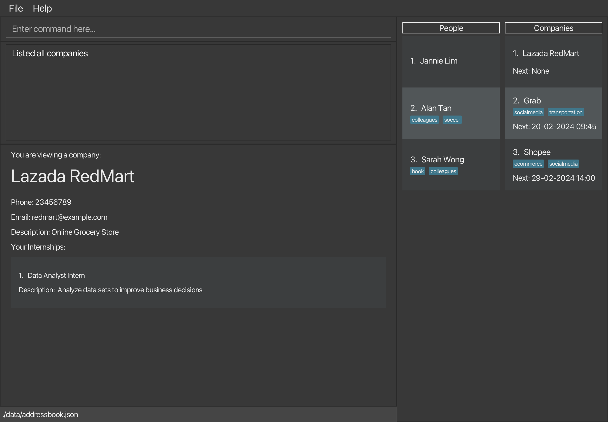

    2. **Test case:** `sort c` 
       **Expected:** List of Companies is sorted by the earliest internship start date. As Lazada RedMart's internship does
       not have a start date, it is not displayed in the list.
    3. **Test case:** `sort c start/25-02-2024 00:01` 
       **Expected:** Shopee appears above Grab in the list, as its internship's scheduled interview time within that time range starts earlier than
       that of Grab's. 
       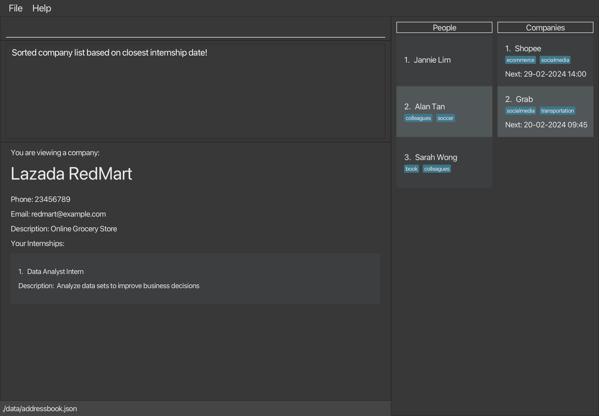
    4. **Test case:** `sort c start/01-03-2024 00:01 end/18-05-2024 00:01` 
       **Expected:** Only grab is displayed in the list, as it is the only company with an internship within the time range.
    5. **Test case:** `sort c start/ILLEGAL_DATETIME` 
       **Expected:** Error message `Invalid command format!...` is shown in the Command Result Box. Planned enhancement: To
       show a more specific error message.

#### Deleting A Person or A Company

1. Deleting a person
   
:information_source: 
    **Note:** Prerequisite: There are people in the List of People.
   

    
   1. **Test case:** `delete p 1` 
      **Expected:** The first person in the list is deleted. The Command Result Box will display the details of the deleted
      person.
   2. **Test case:** `delete p x` where x is larger than the list size or non-positive. 
      **Expected:** Error message `The person index provided is invalid!` is shown in the Command Result Box.
   3. **Test case:** `delete p` 
      **Expected:** Error message `Invalid Command format...` is shown in the Command Result Box.
2. Deleting a company
   1. Prerequisite: There are companies in the List of Companies.
   2. **Test case:** `delete c 1` 
      **Expected:** The first company in the list is deleted. The Command Result Box will display the details of the
      deleted company.
   3. **Test case:** `delete c x` where x is larger than the list size or non-positive. 
      **Expected:** Error message `The company index provided is invalid!` is shown in the Command Result Box.
   4. **Test case:** `delete c` 
      **Expected:** Error message `Invalid Command format...` is shown in the Command Result Box.

#### Deleting an internship

1. Deleting an internship from a company
    

    :bulb: **Tip:** You are encouraged to run the command `list c`, then `view c [COMPANY_INDEX]` command to display the indexes of the internships, before running the following command.
    

    
:information_source: 
    **Note:** Prerequisite: There is at least 1 company contact with at least 1 internship.
    

    1. **Test case:** `delete i c/2 i/1` 
       **Expected:** Assuming the second company has at least one internship, the first internship from the second company
       in the list is deleted. Summary of the deleted internship are shown in the Command Result Box.

    2. **Test case:** `delete i c/2 i/0` 
       **Expected:** No internship is deleted. Error details shown in the Command Result Box, indicating the index for the
       internship is invalid.

    3. Other incorrect delete internship commands to try: `delete i c/x i/y`, `delete i c/1 i/`, `delete i c/ i/1`,
       where `x` is larger than the list size of companies or non-positive, `y` is larger than the list size of internships for the
       chosen company or non-positive, or either index is omitted. 
       **Expected:** No internship is deleted. Error details `The company index provided is invalid!` shown in the Command Result Box.

### Saving data

1. Dealing with missing/corrupted data files

    1. SOCareers will start with an empty addressbook.json file, all data that was previously entered will be wiped. You will have to add all entities in manually.

2. Test Cases
    1. **Test case:** Exiting the program at any point when the application is running. 
       **Expected:** No data loss and all information added up to that point is kept.
   2. **Test case:** Corrupt the addressbook.json file by deleting a "companyName" field for one of the companies 
      **Expected:** SOCareers will start with an empty addressbook.json file, all data that was previously entered will be wiped.
--------------------------------------------------------------------------------------------------------------------

## **Appendix: Planned Enhancements**

### Improved Error Responses for `add` Command

For some inputs, the `add` command may give a misleading error message.
For example, the command, `add p n/John  Doe p/98765432 e/johnd@example.com a/311, Clementi Ave 2, #2-25 t/friends t/owesMoney`. (Note the 2 spaces between `John` and `Doe`.)

Gives the misleading error message, `Names should only contain alphabetic characters and spaces, and it should not be blank.`
We plan to make the error message warn the user which part of the message failed and the reason for the failure: `Person contact cannot be added as it has 2 or more consecutive spaces in it name.`

### Capitalisation Checking of Duplicate Contact for `add` Command

Users can add person and company contacts with the same name but with characters of capitalised differently.
For example, both `John Doe` and `john doe` can be added into the list of persons. Similarly for companies, `Apple Inc.` and `apple inc.` can both be added into the list of companies.

We would like to improve the handling of duplicate contacts, by disallowing the addition of a contact if their name (in lowercase) matches any other name (in lowercase).

### More Specific Error Messages for `sort c` Command

The current error notifications for `sort c` are not sufficiently informative.
For instance, when a user inputs a datetime in an incorrect format, the error message `Invalid command format!...` appears.

Our intention is to replace this with the more specific error messages: 
`Invalid datetime format! Please enter a valid datetime in the format dd-MM-yyyy HH:mm` for formatting issues, or `End datetime cannot be earlier than start datetime!` for chronological errors.

### More Specific Error Messages for `find` Command

The error messages for the `find` command (of which `find p` and `find c` are a subset of) lack detailed information.
Currently, if a user submits a command with either empty or incorrect name or tag keywords, they receive a vague error message: `Invalid command format!...`. 

We aim to implement more explicit error messages.
For errors related to name keywords, the message will
be `Invalid name keyword! Please enter a valid name keyword. The name keyword cannot be empty and must be alphabetic without spaces`.
For tag keyword errors, the message will read `Invalid tag keyword! Please enter a valid tag keyword. The tag keyword cannot be empty and must be alphanumeric without spaces`.

### Relaxed Constraints for `find c` Commands

Currently, the `find c` command only allows alphabetical company name keywords.

We would like to relax this constraint to allow alphanumeric characters and some punctuations like & , . - to match the restrictions for company name to make finding a company more intuitive.

### Improved View in the Display Box for `delete c` and `delete p` Commands

If a contact is being viewed in the Display Box with `view p` or `view c`, doing `delete` on the contact being viewed will remove the contact from the respective List of Persons and List of Companies but will still appear in the Display Box. The message `You are viewing a company/person` that persists in the Display Box may be confusing to the user who may think the contact has not been successfully deleted.

Thus, when the `delete` command is run, we would like to add the message `You have just deleted this person/company:` in the Display Box while displaying the deletec contact, so as to provide concrete confirmation that the company has been successfully deleted.

### Improved View in the Display Box for `edit p`, `edit c`, `edit i` and `delete i` Commands

If a contact is being viewed in the Display Box with `view p` or `view c`, doing `edit` or `delete i` on the contact being viewed will not update the viewed contact in the Display Box. To display the updated details, `view p` or `view c` will have to be run again.

`edit i` on the other hand will show the company with its internship affected, but the display message of `You are viewing a company/person:` gives no indication that an internship field was changed. This may confuse the user, who may wonder why the company was displayed.

We plan to make `edit p`, `edit c`, `edit i` and `delete i` commands change the Display Box to show the edited entity, and display a more helpful message to the user in the Command Result Box. (e.g. `You just edited this person: `)

### Scrollable Display Box 

If any of the parameters for an entity are too long, the parameters will get cut off in the display box, with the remainder of the field replaced by ellipsis. Hence, we want to make the display box horizontally scrollable so that these parameters can still be viewed.

### Limit Tag Length

If the tag of a company/person is too long, it may get cut off like so:

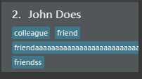

Hence, we plan to limit the length of a tag for our entities so that it does not get cut off in the list.

--------------------------------------------------------------------------------------------------------------------

## **Appendix: Effort**

We believe that the difficulty level of this project was quite high. Compared to AB3, which only had 1 entity: persons,
we had 3: Person, Company and Internship (nested within Company). This forced us to get familiar with the low level implementation
of AB3, in order to modify the Json related classes to add the appropriate entities.

Some of us were also not completely familiar with technologies introduced in this course, including Gradle, JavaFX, PlantUML and
JSON. Hence, extra effort was also spent to familiarize ourselves with them. In addition, compared to the AB3 team which built
this product from ground up and hence had a good grasp of the codebase, we had to go through the code and diagrams ourselves
to understand the structure of the code, which also took quite a lot of time.

Although our code was built upon the base of AB3, we had to modify and expand a large amount of them. The addition of 2 unique entities
required significant planning, coding and modification of the existing AB3 Model and Command classes on our part. Each 
of us also spent a significant amount of time writing tests for the new code, even improving our code coverage to 80% compared to AB3's of 75%. In addition, 
we also had to change and add on to the Ui to accommodate the additions, which required us to have a good understanding of JavaFX and the codebase.
