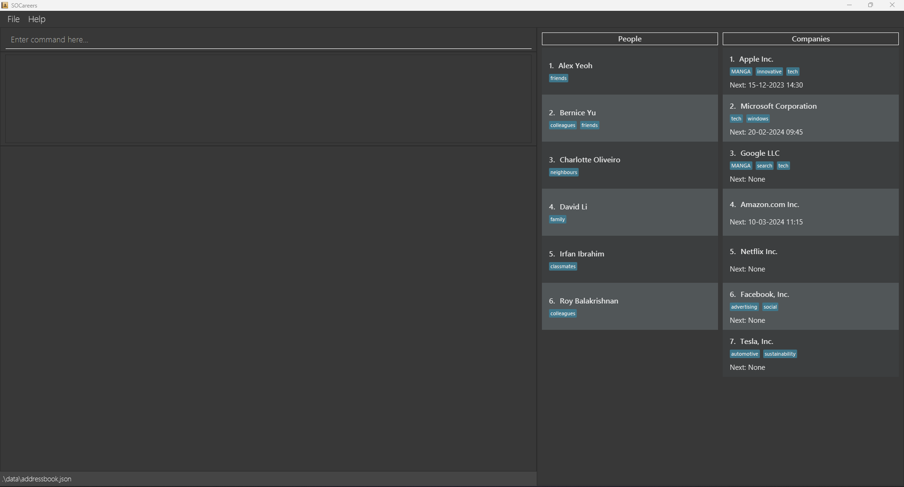
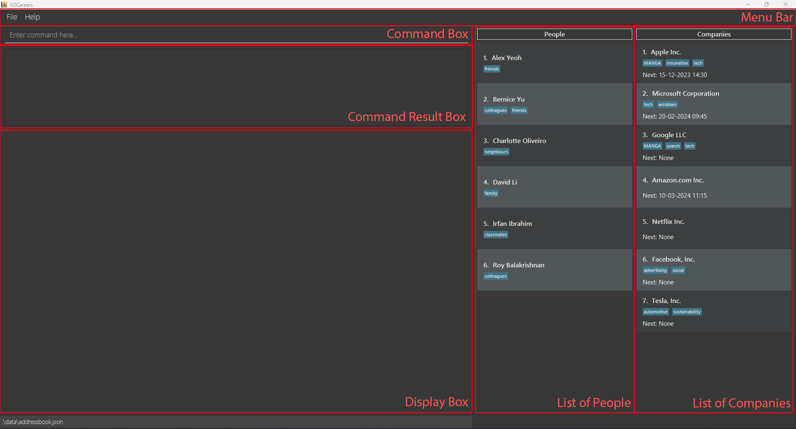
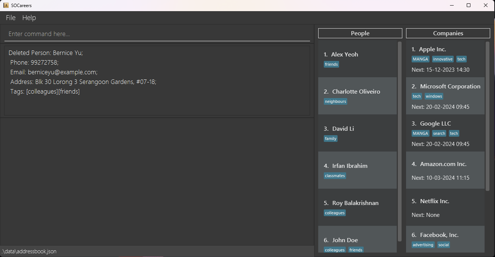
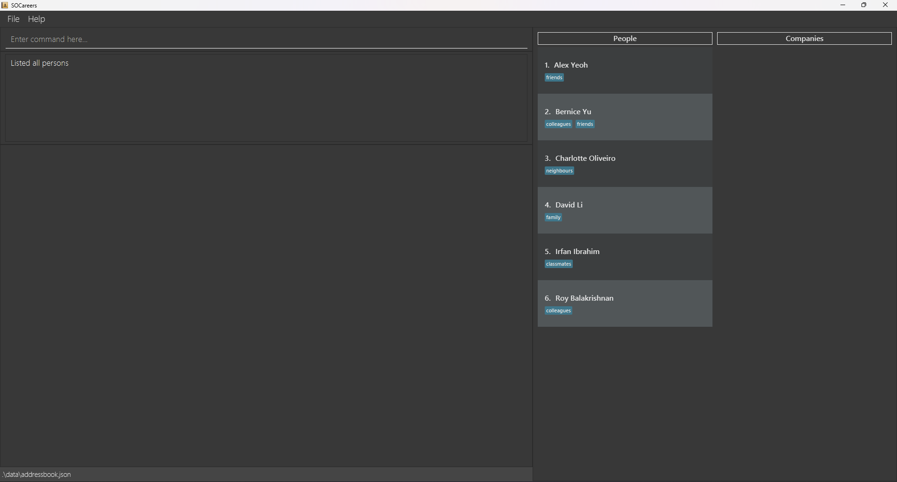
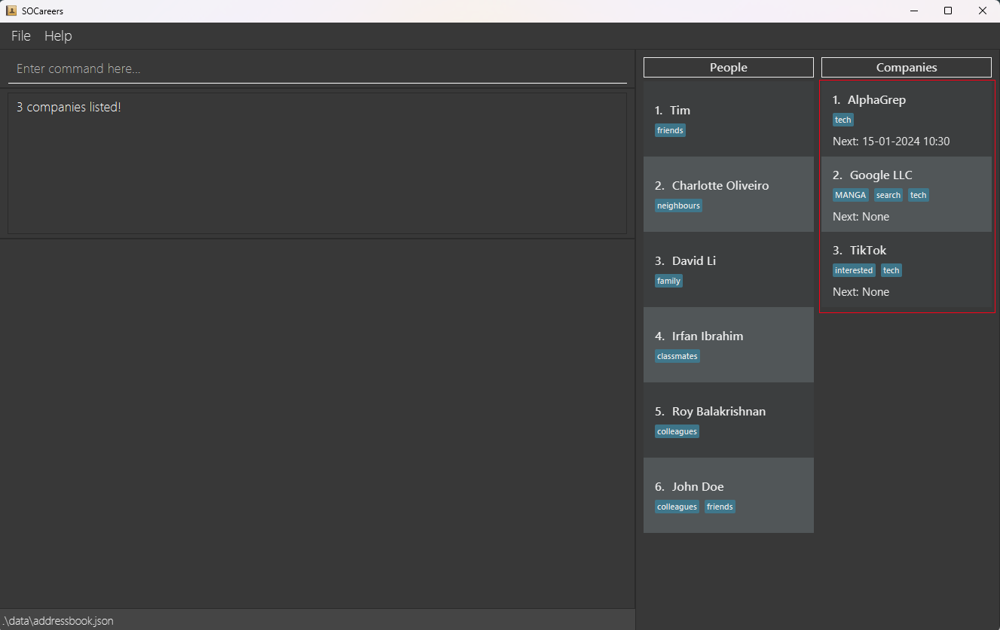
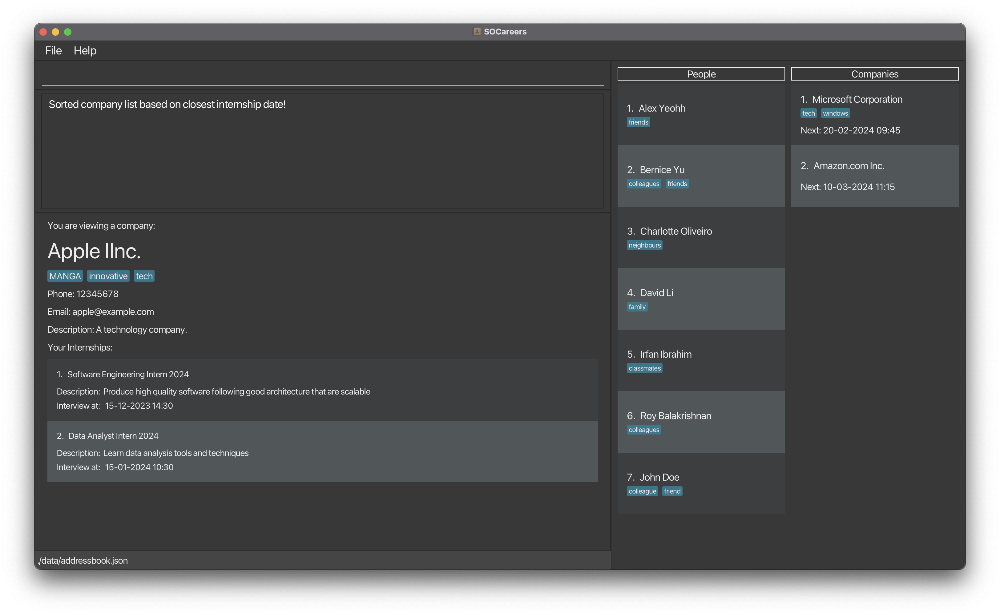

# SOCareers User Guide
Welcome to the SOCareers User Guide! In this guide, we explain how to use the features available in SOCareers.

## Why choose SOCareers?
While we were applying to internships in our second year, we quickly realised how tedious it was to record everything in
various Excel sheets and Word documents, so SOCareers was born!

SOCareers is your ultimate companion to managing your professional connections and internship applications.
Designed with School of Computing (SoC) students in mind, it is optimised for use via a
Command Line Interface (CLI). This enables you to organise your information more efficiently than traditional Graphical
User Interface (GUI) apps.

## How to use our guide
If you are a new user, we recommend you look through our [Quick Start](#quick-start) guide. With installation
instructions, an overview of our GUI and a tutorial on how to use the CLI, it has everything to get you acquainted with
SOCareers!

If you are an experienced user, you can use the [Table of Contents](#table-of-contents) to easily find guides on your
desired commands. A [command summary](#command-summary) is also available if you prefer to have a quick reference for
our command syntax!

Throughout the user guide, you will encounter these call-out boxes. Here are what they indicate:

**:information_source: Information** 
Additional information to enrich your understanding.

**:bulb: Tip** 
Handy tips to enhance your experience with SOCareers.

**:warning: Warning** 
Information that is important to know to prevent unexpected or undefined behaviour from SOCareers.

## Table of Contents
1. [Quick Start](#quick-start)
1. [Features](#features)
   1. Adding a contact
      1. [Adding a person to contacts](#adding-a-person-to-contacts--add-p)
      2. [Adding a company to contacts](#adding-a-company-to-contacts--add-c)
      3. [Adding an internship to a company contact](#adding-an-internship-to-a-company-contact--add-i)
   2. Deleting a contact
      1. [Deleting a person from contacts](#deleting-a-person-from-contacts--delete-p)
      2. [Deleting a company from contacts](#deleting-a-company-from-contacts--delete-c)
      3. [Deleting an internship from a company contact](#deleting-an-internship-from-a-company-contact--delete-i)
   3. Listing contacts
      1. [Listing all persons](#listing-all-persons--list-p)
      2. [Listing all companies](#listing-all-companies--list-c)
   4. Viewing a contact
      1. [Viewing a person's contact](#viewing-a-persons-contact--view-p)
      2. [Viewing a company's contact](#viewing-a-companys-contact--view-c)
   5. Editing a contact 
      1. [Editing a person's contact](#editing-a-persons-contact--edit-p)
      2. [Editing a company's contact](#editing-a-companys-contact--edit-c)
      3. [Editing an internship](#editing-an-internship--edit-i)
   6. Finding a contact by name or tag
      1. [Finding a person by name or tag](#finding-a-person-by-name-or-tag--find-p)
      2. [Finding a company by name or tag](#finding-a-company-by-name-or-tag--find-c)
   7. [Sort and filter companies](#sort-and-filter-companies)
3. [FAQ](#faq)
4. [Command Summary](#command-summary)

------------------------------------------------------------------------------------------------------------------------

## Quick Start
### Installation

1. Ensure you have Java `11` or above installed in your computer.

1. Download the latest `SOCareers.jar` [here]([https://github.com/AY2324S1-CS2103T-T10-4/tp/releases).

1. Move `SOCareers.jar` to the _home folder_ which is the folder you want to store SOCareers' internal data.

**:information_source: Information** 
The home folder's contents may be changed by SOCareers.
It is recommended to create a new empty folder to act as a home folder.

1. Open a command terminal, navigate into the folder you put the jar file in using `cd` , and run the command
`java -jar SOCareers.jar` to start the application. 
   * A GUI similar to the one shown below should appear in a few seconds.
   * Note that the app contains some sample data. 

2. Our Ui has 6 main sections:
   
    * **MenuBar**: Provides quick access to essential features of "Help" and "File".
    * **Command Box**: Allows you to type in your commands.
    * **Command Result Box**: Displays the result of running a command.
    * **Display Box**: Displays all the details of a person or a company after certain commands are run.
    * **List of People**: Displays brief details of every person added. The index, name and tags for each person are displayed here.
    * **List of Companies**: Displays brief details of every company added. The index, name, tags and the next internship interview date (represented by the "Next:" field) for each company are displayed here.

3. Type the command in the command box and press Enter to run it.
   Here are some examples of commands you can run:

   * `list p` : Lists all contacts.

   * `add p n/John Doe p/98765432 e/johnd@example.com a/John street, block 123, #01-01` : Adds a person contact named `John Doe` to SOCareers.

   * `delete c 3` : Deletes the 3rd company contact shown in the current list.

   * `exit` : Exits the app.

4. Refer to the [Features](#features) below for details of each command.
------------------------------------------------------------------------------------------------------------------------

## Features

**:information_source: Notes about the command format:** 

* Words in `UPPER_CASE` are the parameters to be supplied by the user. 
  e.g. in `add p n/NAME p/PHONE_NUMBER e/EMAIL a/ADDRESS`, all the parameters must be supplied.

* Items in square brackets are optional. 
  e.g. `n/NAME [t/TAG]` can be used as `n/John Doe t/friend` or as `n/John Doe`.

* Parameters can be in any order. 
  e.g. if the command specifies `n/NAME p/PHONE_NUMBER e/EMAIL`, `e/EMAIL p/PHONE_NUMBER n/NAME` is also acceptable.

* If you are using a PDF version of this document, be careful when you copy and paste commands that span multiple lines
as space characters surrounding line-breaks may be omitted when copied over to the application.

### Adding a person to contacts: `add p`

Keep track of who you know easily by adding them to your contacts.

Format: `add p n/NAME p/PHONE_NUMBER e/EMAIL a/ADDRESS [t/TAG]`

Parameters
* A person's `NAME`, `PHONE_NUMBER`, `EMAIL`, and `ADDRESS` are compulsory.
* A `TAG` is optional and can be used multiple times.

Example
* `add p n/John Doe p/98765432 e/johnd@example.com a/311, Clementi Ave 2, #02-25 t/friend t/colleague`:
  

### Adding a company to contacts: `add c`

Effortlessly manage your list of preferred companies by adding them to your contacts.

Format: `add c n/COMPANY_NAME p/PHONE_NUMBER e/EMAIL d/DESCRIPTION [t/TAG]`

Parameters
* A company's `COMPANY_NAME`, `PHONE_NUMBER`, `EMAIL`, and `DESCRIPTION` are compulsory.
* A `TAG` is optional and can be used multiple times.

Example
* `add c n/Apple p/98765432 e/applehr@example.com d/Top tech company t/tech t/interested`:
  

### Adding an internship to a company contact: `add i`

Add internships that interest you to the corresponding companies.

Format: `add i INDEX n/ROLE_NAME d/DESCRIPTION [s/SCHEDULED_INTERVIEW_TIME]`
* Adds an internship to the company at the specified `INDEX` in the currently displayed contact list of companies.

Parameters
* An internship's `INDEX`, `ROLE_NAME` and `DESCRIPTION` are compulsory.
  * `INDEX` refers to the index number shown in the displayed companies list.
  * `INDEX` must be a positive integer and cannot be larger than the size of the currently displayed contact list of companies. 
  * `ROLE_NAME` and `DESCRIPTION` can be any non-empty string and should not be blank.
* `SCHEDULED_INTERVIEW_TIME` is optional and can only be used once.
  * `SCHEDULED_INTERVIEW_TIME` must be in the format `DD-MM-YYYY HH:mm`.

Examples
* `add i 2 n/Software Engineering Intern 2024 d/Develop new features on existing software products`
* `add i 3 n/Marketing Intern 2024 d/Conduct market research and analysis s/20-02-2024 09:45`

### Deleting a person from contacts: `delete p`

Keep your list of contacts for people organised by deleting contacts you no longer need.

Format: `delete p INDEX`
* `INDEX` refers to the index number shown in the currently displayed contact list of people.
* Deletes the contact of the person at the specified `INDEX` in the currently displayed contact list of people.

Parameter
* `INDEX` is compulsory.
    * `INDEX` must be a positive integer and cannot be larger than the size of the currently displayed contact list of people.

Example
* `list p` followed by `delete p 2` deletes the second person in the list:
  
### Deleting a company from contacts: `delete c`

Keep your list of contacts for companies organised by deleting contacts you no longer need.

Format: `delete c INDEX`
* `INDEX` refers to the index number shown in the currently displayed contact list of companies.
* Deletes the contact of the company at the specified `INDEX` in the currently displayed contact list of companies.

Parameter
* `INDEX` is compulsory.
    * `INDEX` must be a positive integer and cannot be larger than the size of the currently displayed contact list of companies.

Example
* `list c` followed by `delete c 2` deletes the second company in the list:
  

### Deleting an internship from company: `delete i`

Keep your list of internships for companies organised by deleting internships you no longer need.

Format: `delete i c/INDEX i/INDEX`
* `c/INDEX` refers to the index number shown in the currently displayed contact list of companies.
* `i/INDEX` refers to the index number shown in the currently displayed internship list of the target company.
* Deletes the internship with index `INDEX` of the company at the specified `INDEX` in the currently displayed contact list of companies.

Parameter
* The two `INDEX` fields are both compulsory.
    * `INDEX` with `c/` prefix must be a positive integer and cannot be larger than the size of the currently displayed contact list of companies.
    * `INDEX` with `i/` prefix must be a positive integer and cannot be larger than the size of the currently displayed internship list of the target company.

Example
* `list c` and `view c 2` followed by `delete i c/2 i/1` deletes the first internship of the second company in the list:

### Viewing a list of all persons: `list p`

Have a quick look at all the people you know in the contact list.

Format: `list p`

* `list p` shows:

### Listing all companies: `list c`

Have a quick look at all the companies you are interested in in the contact list.

Format: `list c`

* `list c` shows:
  

### Viewing a person's contact: `view p`

Find out the specific details of your desired contact by viewing that person's contact.

Format: `view p INDEX`
* `INDEX` refers to the index number shown in the currently displayed contact list of companies.
* Views the contact with the specified `INDEX` from the contact list.

Parameter
* `INDEX` is compulsory.
    * `INDEX` must be a positive integer and cannot be larger than the size of the currently displayed contact list of people.

Example
* `list p` followed by `view p 1` views the first contact in the contact list:
  

### Viewing a company's contact: `view c`

Find out the specific details of your desired company by viewing that company's contact.

Format: `view c INDEX`
* Views the contact with the specified `INDEX` from the contact list.
* `INDEX` refers to the index number shown in the currently displayed contact list of companies.

Parameter
* `INDEX` is compulsory.
    * `INDEX` must be a positive integer and cannot be larger than the size of the currently displayed contact list of companies.

Example
* `list c` followed by `view c 1` views the first contact in the companies list:
  

### Editing a person's contact: `edit p`

Edit the information of a person's contact.

Format: `edit p INDEX [n/NAME] [p/PHONE_NUMBER] [e/EMAIL] [a/ADDRESS] [t/TAG]`
* At least one of the `NAME`, `PHONE_NUMBER`, `EMAIL`, `ADDRESS` or `TAG` fields should be included.

Examples:
* `edit p 1 n/John p/98765432 e/john@example.com a/311, Clementi Ave 2, #02-26 t/friend`

### Editing a company's contact: `edit c`

Edit the information of a company's contact.

Format: `edit c INDEX [n/NAME] [p/PHONE_NUMBER] [e/EMAIL] [d/DESCRIPTION] [t/TAG]`
* At least one of the `NAME`, `PHONE_NUMBER`, `EMAIL`, `DESCRIPTION` or `TAG` fields should be included.

Examples:
* `edit c 1 n/Alpha p/98765432 e/alpha@example.com d/A cool company t/tech`

### Editing an internship: `edit i`

Edit the information of an internship. 

Format: `edit i c/COMPANY_INDEX i/INTERNSHIP_INDEX [n/ROLE_NAME] [d/DESCRIPTION] [s/SCHEDULED_INTERVIEW_TIME]`
* At least one of the `ROLE_NAME`, `DESCRIPTION` or `SCHEDULED_INTERVIEW_TIME`

Examples:
* `edit i c/2 i/3 n/Finance Intern 2024 s/20-02-2024 09:45`

### Finding a person by name or tag: `find p`

Search for a particular person by their name or using a tag you have assigned them.

Format: `find p [n/KEYWORD] [t/TAG]`
* Finds a person by name or tag.

Parameters:
* At least one of the parameters must be supplied.
* `KEYWORD` and `TAG` are optional and can be used multiple times.
  * They must be alphanumeric.
  * They cannot contain special characters or spaces.

Search Constraints:
* The search is case-insensitive. e.g. `john` will match `John`.
  * Partial keywords are not supported. e.g. `Jo` will not match `John`.
* Only the name and tags are searched.
* Persons matching at least one of the keywords and tags will be returned (i.e. OR search).

Example
* `find p n/John t/friend` returns `John Doe`:
  

### Finding a company by name or tag: `find c`

Search for a particular company by their name or using a tag you have assigned them.

Format: `find c [n/KEYWORD] [t/TAG]`
* Finds a company by name or tag.

Parameters:
* At least one of the parameters must be supplied.
* `KEYWORD` and `TAG` are optional and can be used multiple times.
    * They must be alphanumeric.
    * They cannot contain special characters or spaces.

Search Constraints:
* The search is case-insensitive, e.g. `apple` will match `Apple`.
    * Partial keywords are not supported, e.g. `Ap` will not match `Apple`.
* Only the name and tags are searched.
* Companies matching at least one of the keywords and tags will be returned (i.e. OR search).

Example
* `find c n/Apple t/tech` returns `Apple`:
  

### Sort and filter companies

Filter out companies that have internships in the specified time period and display them in order of their most recent interview date (in the specified time period).

Format: `sort c [start/START_DATETIME] [end/END_DATETIME]`

Parameters:
* `START_DATETIME` and `END_DATETIME` must be in the format `DD-MM-YYYY HH:mm`.
* `START_DATETIME` and `END_DATETIME` are optional and each can only be used once.
* `START_DATETIME` must be before `END_DATETIME`, otherwise no companies will be returned (no error message either).
* `START_DATETIME` and `END_DATETIME` may be in the past or future.

Expected behaviour:
* Even if `START_DATETIME` and `END_DATETIME` are not specified, only companies with internships will be returned.
* If `START_DATETIME` or (and) `END_DATETIME` are specified, only companies with internships in the specified time period will be returned.
* Companies that have internships in the specified time period will be sorted in order of their most recent interview date (only internships in the specified time period will be considered in sorting). But the `next` field of the company will not be updated, regardless of whether they are in the specified time period. Also, if you view a specific company, all its internships will be shown, regardless of whether they are in the specified time period.
* `START_DATETIME` and `END_DATETIME` are non-inclusive, i.e. internships on `START_DATETIME` or `END_DATETIME` will not be considered.
* If there are no companies with internships in the specified time period, an empty list will be returned.
* If there are no companies with internships, an empty list will be returned.
* If there are no companies, an empty list will be returned.

Examples:
* `sort c start/01-02-2024 00:01 end/01-04-2024 00:01` returns `Microsoft` and `Amazon`:
  

--------------------------------------------------------------------------------------------------------------------

## FAQ

**Q**: How do I transfer my data to another computer? 
**A**: Install the app in the other computer and overwrite the empty data file it creates with the file that contains the data of your previous SOConnect home folder.

--------------------------------------------------------------------------------------------------------------------

## Command Summary

| Action | Format                            | Examples                                                                                                                                                                                              |
|--------|-----------------------------------|-------------------------------------------------------------------------------------------------------------------------------------------------------------------------------------------------------|
| Add    | `add c`, `add p`                  | e.g., `add p n/John Doe p/98765432 e/johnd@example.com a/311, Clementi Ave 2, #02-25 t/friends t/owesMoney`; `add c n/Apple p/98765432 e/johnd@example.com d/Top tech companyt/tech t/interested` |
| Delete | `delete c INDEX`, `delete p INDEX` | e.g., `delete p 3`                                                                                                                                                                                    |
| List   | `list c`, `list p`                |                                                                                                                                                                                                       |
| View   | `view c INDEX`, `view p INDEX`    | e.g., `view c 1`                                                                                                                                                                                      |
| Edit   | `edit c INDEX`, `edit p INDEX`    | e.g., `edit p 1 n/John p/98765432 e/john@example.com a/311, Clementi Ave 2, #02-26 t/friend`;  `edit c 1 n/Alpha p/98765432 e/alpha@example.com d/A cool company t/tech`                           |                                                                                                                                                                                    |
| Find     | `find c`, `find p`                | e.g., `find p n/John Doe t/friend`                                                                                                                                                                    |
| Sort and filter | `sort c`                          | e.g., `sort c start/01-02-2024 00:01 end/01-04-2024 00:01`                                                                                                                                            |

