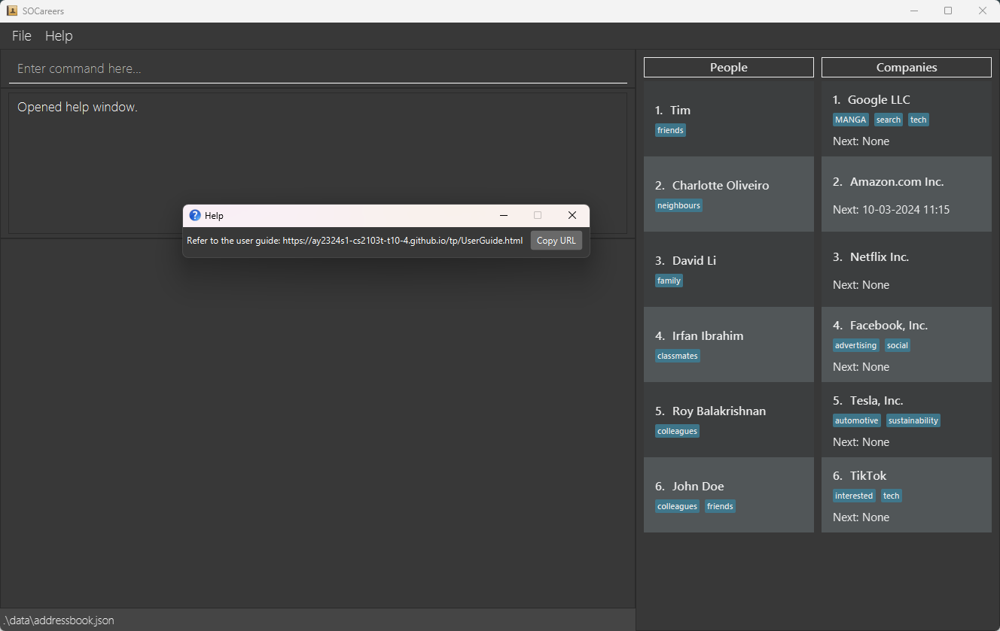
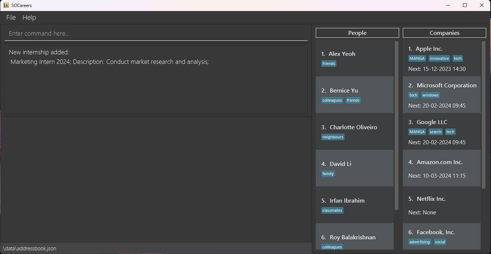
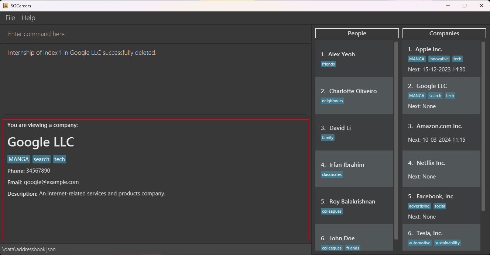
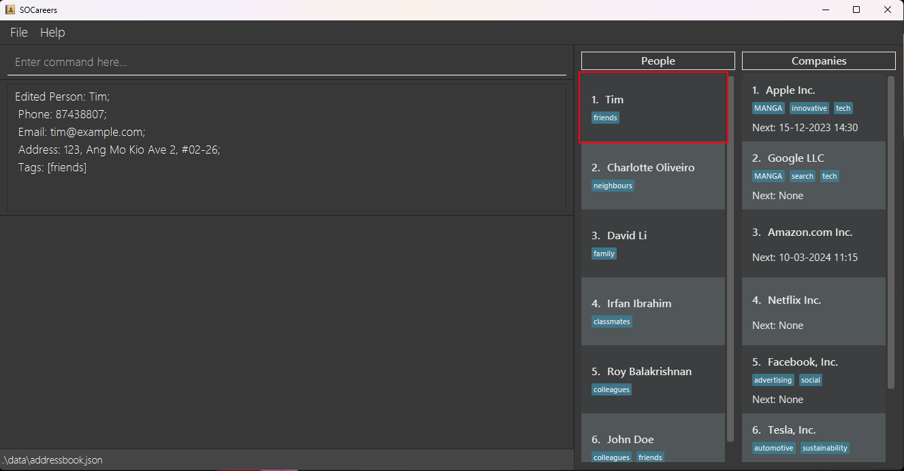
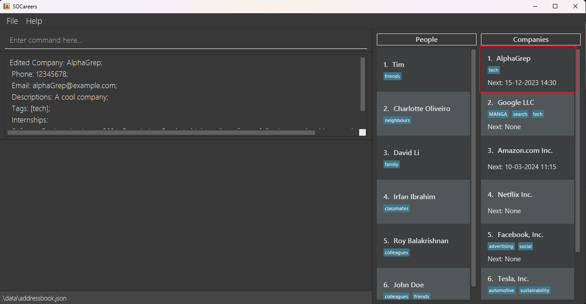
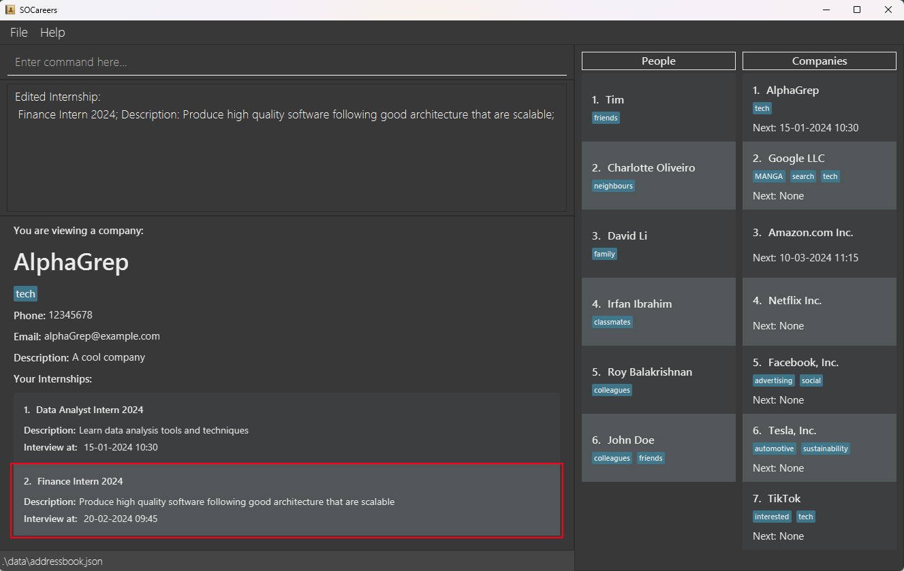
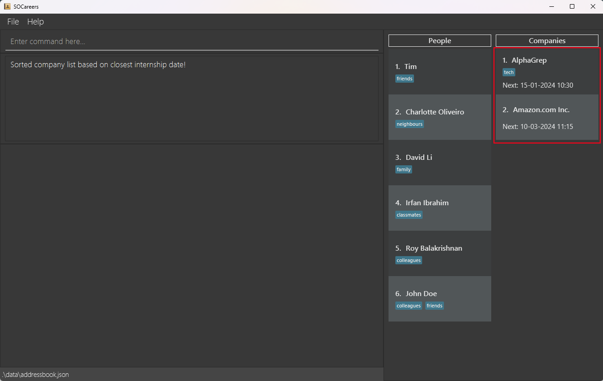
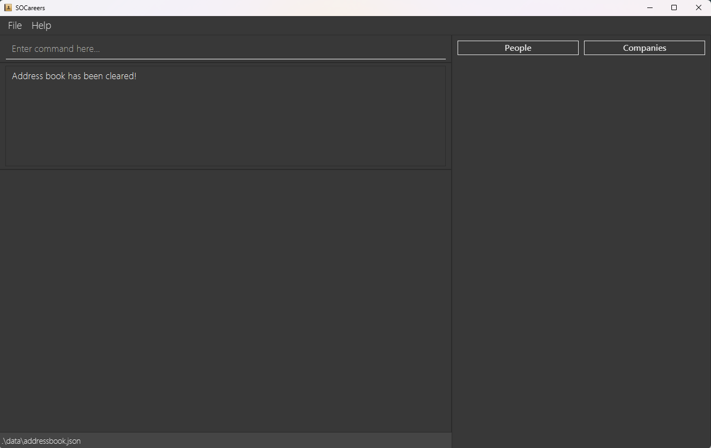

Welcome to the SOCareers User Guide! In this guide, we explain how to use the features available in SOCareers.

## Why choose SOCareers?
While we were applying to internships in our second year, we quickly realised how tedious it was to record everything in
various Excel sheets and Word documents, so SOCareers was born!

SOCareers is your ultimate companion to managing your professional connections and internship applications.
Designed with School of Computing (SoC) students in mind, it is optimised for use via a Command Line Interface (CLI).
If you can type fast, SOCareers enables you to organise your information more efficiently than traditional Graphical
User Interface (GUI) apps.

## How to use our guide
Our user guide provides the format of every command available in SOCareers as well as
examples to show you how to use each command.

If you are a **new user**, we recommend you look through our [Quick Start](#quick-start) guide. With installation
instructions, an overview of our GUI and a tutorial on how to use the CLI, it has everything to get you acquainted with
SOCareers!

If you are an **experienced user**, you can use the [Table of Contents](#table-of-contents) to easily find guides on your
desired commands. A [command summary](#command-summary) is also available if you prefer to have a quick reference for
our command formats!

Throughout our user guide, you will encounter different text formats or call-out boxes. Here are what they indicate: 

**:warning: Warning** 
Information that is important to know to prevent unexpected or undefined behaviour from SOCareers.

**:pencil: Parameter Information** 
Details about parameters and their constraints to ensure SOCareers works as intended.

**:bulb: Tip** 
Handy tips to enhance your experience with SOCareers.

**:information_source: Additional Information** 
Additional information to enrich your understanding of SOCareers.

[Highlighted text](#): Links to jump to the corresponding sections in the user guide 

`Monospaced text`: Command formats to guide your usage of SOCareers

## Table of Contents
1. [Quick Start](#quick-start)
1. [Features](#features)
   1. [Viewing the User Guide](#viewing-the-user-guide-help)
   1. [Adding a contact](#adding-a-contact-add)
      1. [Adding a person](#adding-a-person-add-p)
      2. [Adding a company](#adding-a-company-add-c)
      3. [Adding an internship](#adding-an-internship-add-i)
   2. [Listing contacts](#listing-contacts-list)
      1. [Listing all persons](#listing-all-persons-list-p)
      2. [Listing all companies](#listing-all-companies-list-c)
   3. [Deleting a contact](#deleting-a-contact-delete)
      1. [Deleting a person](#deleting-a-person-delete-p)
      2. [Deleting a company](#deleting-a-company-delete-c)
      3. [Deleting an internship](#deleting-an-internship-delete-i)
   4. [Viewing a contact](#viewing-a-contact-view)
      1. [Viewing a person](#viewing-a-person-view-p)
      2. [Viewing a company](#viewing-a-company-view-c)
   5. [Editing a contact](#editing-a-contact-edit)
      1. [Editing a person](#editing-a-person-edit-p)
      2. [Editing a company](#editing-a-company-edit-c)
      3. [Editing an internship](#editing-an-internship-edit-i)
   6. [Finding a contact](#finding-a-contact-find)
      1. [Finding a person by name or tag](#finding-a-person-by-name-or-tag-find-p)
      2. [Finding a company by name or tag](#finding-a-company-by-name-or-tag-find-c)
   7. [Sorting contacts](#sorting-contacts-sort)
      1. [Sorting companies by scheduled interview time](#sorting-companies-by-scheduled-interview-time-sort-c)
   8. [Clearing all contacts](#clearing-all-contacts-clear)
   8. [Exiting SOCareers](#exiting-socareers-exit)
3. [Frequently Asked Questions (FAQ)](#frequently-asked-questions-faq)
4. [Known Limitations](#known-limitations)
5. [Command Summary](#command-summary)

------------------------------------------------------------------------------------------------------------------------

## Quick Start
### Installation

1. Ensure you have Java `11` or above installed in your computer by running the command
    `java --version` in your terminal.

2. Download the latest version of `SOCareers.jar` [here](https://github.com/AY2324S1-CS2103T-T10-4/tp/releases).

3. Move `SOCareers.jar` to the home folder which is the folder you want to store SOCareers' internal data.

**:information_source: Additional Information** 
The home folder's contents may be changed by SOCareers. We recommend you to create a new empty folder to act as your home folder.

### Running SOCareers
1. Open a command terminal.
2. Navigate your home folder by running the command `cd FILEPATH` where `FILEPATH` is the file path to your home folder.
3. Run the command `java -jar SOCareers.jar`  to start the application.
    * A GUI similar to the one shown below should appear in a few seconds.
    * Note that the app contains some sample data that you can later remove.
4. Our User Interface (UI) has 6 main sections:  
     
    * **MenuBar**: Provides quick access to essential features of "Help" and "File".
    * **Command Box**: Allows you to type in your commands.
    * **Command Result Box**: Displays the result of running a command.
    * **Display Box**: Displays all the details of a person or a company after certain commands are run.
    * **List of Persons**: Displays brief details of every person added. The index, name and tags for each person are
    displayed here.
    * **List of Companies**: Displays brief details of every company added. The index, name, tags and the date of the 
    next internship interview (represented by the "Next:" field) for each company are displayed here.  
5. Type the command in the command box and press Enter to run it. Here are some examples of commands you can run:

   * `list p` : Lists all persons

   * `add p n/John Doe p/98765432 e/johnd@example.com a/311 Clementi Ave 2 #02-25 t/friend t/colleague`:
   Adds the person ‘John Doe’ with the following details:
     * Phone number: 98765432
     * Email: johnd@example.com
     * Address: 311 Clementi Ave 2 #02-25 
     * Tags: friends, colleagues

   * `delete c 3` : Deletes the third company shown in the current list of companies

   * `exit` : Exits the app

**:information_source: Notes about the command format:** 

1. Words in `UPPER_CASE` are the parameters to be supplied by the user. 
   * e.g. in `add p n/NAME p/PHONE_NUMBER e/EMAIL a/ADDRESS`, all the parameters must be supplied.

2. Items in square brackets are optional. 
   * e.g. `n/NAME [t/TAG]` can be used as `n/John Doe t/friend` or as `n/John Doe`.

3. Parameters can be in any order. 
   * e.g. if the command specifies `n/NAME p/PHONE_NUMBER e/EMAIL`, `e/EMAIL p/PHONE_NUMBER n/NAME` is also acceptable.

**:warning: Warning** 
If you are using a PDF version of this document, be careful when you copy and paste commands that span multiple lines
as space characters surrounding line-breaks may be omitted when copied over to the application.

 You can refer to the [Prefix Summary](#prefix-summary) section for a summary on constraints on prefixes and the
[Features](#features) section below for details of each command.
[Back to Table of Contents](#table-of-contents)

## Prefix Summary

| **Prefix**                   | **Format**                                                                                                                         | **Example(s)**              |
|------------------------------|------------------------------------------------------------------------------------------------------------------------------------|-----------------------------|
| `a/ADDRESS`                  | Any characters                                                                                                                     | 311, Clementi Ave 2, #02-25 |
| `c/COMPANY_INDEX`            | A positive integer (e.g. 1, 2, 3… 2147483647) that is smaller than the size of the list of companies that is currently displayed   | 1, 10, 26                   |
| `d/DESCRIPTION`              | Any characters                                                                                                                     | A streaming service company |
| `e/EMAIL `                   | `local-part@domain`                                                                                                                | johnd@example.com           |
| `i/INTERNSHIP_INDEX`         | A positive integer (e.g. 1, 2, 3… 2147483647) that is smaller than the size of the list of internships that is currently displayed | 1, 10, 26                   |
| `n/COMPANY_NAME`             | Alphanumeric with spaces and the punctuation & , . -                                                                               | Apple Inc., AT&T            |
| `n/PERSON_NAME `             | Alphabetical with spaces                                                                                                           | John Doe                    |
| `n/ROLE_NAME `               | Any characters                                                                                                                     | Finance Intern 2024         |
| `n/KEYWORD `                 | Alphanumeric without spaces and the punctuation & , . -                                                                            | John, Doe                   |
| `p/PHONE_NUMBER`             | Numerical                                                                                                                          | 91234567                    |
| `s/SCHEDULED_INTERVIEW_TIME` | `DD-MM-YYYY HH:mm` where DD is the day, MM is the month, YYYY is the year and HH:mm is the time in 24-hour notation                | 20-02-2024 09:45            |
| `t/TAG`                      | Alphanumeric                                                                                                                       | CS2103T                     |
| `start/START_TIME`           | `DD-MM-YYYY HH:mm` where DD is the day, MM is the month, YYYY is the year and HH:mm is the time in 24-hour notation                | 20-02-2024 09:45            |
| `end/END_TIME`               | `DD-MM-YYYY HH:mm` where DD is the day, MM is the month, YYYY is the year and HH:mm is the time in 24-hour notation                | 20-02-2024 09:45            |

[Back to Table of Contents](#table-of-contents)
---

## Features

### Viewing the User Guide: `help`

Find help easily by accessing a link to our user guide.

**Format**: `help`

**Example**: `help`
* Provides you with a link to our user guide in a pop-up box 

[Back to Table of Contents](#table-of-contents)

### Adding a contact: `add`

#### Adding a person: `add p`

Keep track of who you know easily by adding them to your contacts.

**Format**: `add p n/PERSON_NAME p/PHONE_NUMBER e/EMAIL a/ADDRESS [t/TAG]`

**:pencil: Parameter Information** 

* `TAG` can be used multiple times in one command 

* `NAME` **cannot** have consecutive spaces

 

**Example**: `add p n/John Doe p/98765432 e/johnd@example.com a/311, Clementi Ave 2, #02-25 t/friends t/colleagues`
* Adds the person named ‘John Doe’ to the list of persons with the following details:
  * Phone number: 98765432
  * Email: johnd@example.com
  * Address: 311, Clementi Ave 2, #02-25
  * Tags: friends, colleagues 

* After running the command, the output in the UI should be similar to the one shown below. The newly added
person has been highlighted in red for clarity:  

[Back to Table of Contents](#table-of-contents)

#### Adding a company: `add c`

Keep track of your favourite companies effortlessly by adding them to your contacts.

**Format**: `add c n/COMPANY_NAME p/PHONE_NUMBER e/EMAIL d/DESCRIPTION [t/TAG]`

**:pencil: Parameter Information** 

`TAG` can be used multiple times in one command

 

**Example**: `add c n/TikTok p/98765432 e/tiktokHiring@example.com d/Top Tech Company t/tech t/interested`
* Adds the company named ‘TikTok’ to the list of companies with the following details:
  * Phone number: 98765432
  * Email: tiktokHiring@example.com
  * Description: Top Tech Company
  * Tags: tech, interested 

* After running the command, the output in the UI should be similar to the one shown below. The newly added
company has been highlighted in red for clarity:  

  

**:information_source: Additional Information** 

Internships must be added separately using the [`add i`](#adding-an-internship-add-i) command

[Back to Table of Contents](#table-of-contents)

#### Adding an internship: `add i`

Keep track of your dream internships efficiently by adding them to their respective companies.

**Format**: `add i INDEX n/ROLE_NAME d/DESCRIPTION [s/SCHEDULED_INTERVIEW_TIME]`

**:pencil: Parameter Information** 
   
* The `INDEX` must be: 
    * a positive integer (e.g. 1, 2, 3…) with a maximum value of 2147483647 
    * smaller than the size of the list of companies that is currently displayed 
   
* The `INDEX` depends on the currently displayed list of companies which changes as
  you sort companies or search for specific companies 

* `SCHEDULED_INTERVIEW_TIME` can only be used **once** and must be in the format `DD-MM-YYYY HH:mm` where
  DD is the day, MM is the month, YYYY is the year and HH:mm is the time in 24-hour notation

 

**Example**: `add i 3 n/Marketing Intern 2024 d/Conduct market research and analysis s/20-02-2024 09:45`
* Adds the internship named ‘Marketing Intern 2024’ to the third company in the list with the following details:
  * Description: Conduct market research and analysis
  * Scheduled interview time: 20 February 2024, 9.45am

* After running the command, the output in the UI should be similar to the one shown below:  
  

**:bulb: Tip** 

* You can use the command [`list c`](#listing-all-companies-list-c) to view all the companies and their indexes before running this command 
* You can use the command [`view c`](#viewing-a-company-view-c) to view company and the added internship, after running this command 

**:information_source: Additional Information** 

The added internship may not always appear at the bottom of the list of internships! This is because the
list of internships is sorted by `SCHEDULED_INTERVIEW_TIME`, with the internship with the earliest
`SCHEDULED_INTERVIEW_TIME` being displayed first. 

[Back to Table of Contents](#table-of-contents)

### Listing contacts: `list`
#### Listing all persons: `list p`

Have a quick overview of all the people you know by viewing your list of persons.

**Format**: `list p` 

**Example**: `list p`
* Shows the full, unfiltered list of persons currently in your contacts 
* After running the command, the output in the UI should be similar to the one shown below. The full list of persons
has been highlighted in red for clarity:  

[Back to Table of Contents](#table-of-contents)

#### Listing all companies: `list c`

Have a quick overview of all the companies you are interested in by viewing your list of companies.

**Format**: `list c` 

**Example**: `list c`
* Shows the full, unfiltered list of companies currently in your contacts 
* After running the command, the output in the UI should be similar to the one shown below. The full list of companies
  has been highlighted in red for clarity:  
  

[Back to Table of Contents](#table-of-contents)

### Deleting a contact: `delete`
#### Deleting a person: `delete p`

Keep your list of persons organised by deleting contacts you no longer need.

**Format**: `delete p INDEX`

**:pencil: Parameter Information** 

* The `INDEX` must be: 
    * a positive integer (e.g. 1, 2, 3…) with a maximum value of 2147483647 
    * smaller than the size of the list of persons that  is currently displayed 

* The `INDEX` depends on the currently displayed list of persons which changes as
you search for specific people 

 

**Example**: `delete p 2`
* Deletes the second person in the list of persons
* After running the command, the output in the UI should be similar to the one shown below: 
  

**:bulb: Tip** 

* You can use the command [`list p`](#listing-all-persons-list-p) to view all the persons and their indexes 
  before running this command 

[Back to Table of Contents](#table-of-contents)

#### Deleting a company: `delete c`

Keep your list of companies organised by deleting companies you are no longer interested in.

**Format**: `delete c INDEX`

**:pencil: Parameter Information** 

* The `INDEX` must be: 
    * a positive integer (e.g. 1, 2, 3…) with a maximum value of 2147483647
    * smaller than the size of the list of companies that is currently displayed

* The `INDEX` depends on the currently displayed list of companies which changes as
you sort companies or search for specific companies 

 

**Example**: `delete c 2`
* Deletes the second company in the list of companies
* After running the command, the output in the UI should be similar to the one shown below: 
  

**:bulb: Tip** 

* You can use the command [`list c`](#listing-all-companies-list-c) to view all the companies and their indexes
  before running this command. 

[Back to Table of Contents](#table-of-contents)

#### Deleting an internship: `delete i`

Keep your list of internships for each company organised by deleting internships you are no longer interested in.

**Format**: `delete i c/COMPANY_INDEX i/INTERNSHIP_INDEX`

**:pencil: Parameter Information** 

* The `COMPANY_INDEX` and `INTERNSHIP_INDEX` must each be: 
    * a positive integer (e.g. 1, 2, 3…) with a maximum value of 2147483647
    * smaller than the size of their respective lists that are currently displayed

* The `COMPANY_INDEX` depends on the currently displayed list of companies which changes as
you sort companies or search for specific companies 

 

**Example**: `delete i c/2 i/1`
* Deletes the first internship of the second company in the list of companies that is currently displayed
* After running the command, the output in the UI should be similar to the one shown below.
The company you have just deleted the internship from will also be shown in the display box which has been highlighted
in red for clarity:  
  

**:bulb: Tip** 

* You can use the command [`list c`](#listing-all-companies-list-c) to view all companies and their indexes before running this command. 
* You can use the command [`view c`](#viewing-a-company-view-c) to view the company, all its internship and their indexes before running this command. 

[Back to Table of Contents](#table-of-contents)

### Viewing a contact: `view`
#### Viewing a person: `view p`

Review the information you included about the people you know efficiently by viewing their respective contacts.

**Format**: `view p INDEX`

**:pencil: Parameter Information** 

* The `INDEX` must be: 
    * a positive integer (e.g. 1, 2, 3…) with a maximum value of 2147483647 
    * smaller than the size of the list of persons that is currently displayed 

* The `INDEX` depends on the currently displayed list of persons which changes as
you search for specific people 

 

**Example**: `view p 1`
* Displays the first contact in the person list in the display box
* After running the command, the output in the UI should be similar to the one shown below:  
    

**:bulb: Tip** 

* You can use the command [`list p`](#listing-all-persons-list-p) to view all the persons and their indexes before running this command. 

[Back to Table of Contents](#table-of-contents)

#### Viewing a company: `view c`

Review the information you included about the companies you are interested in and all their associated internships by
viewing their respective contacts.

**Format**: `view c INDEX`

**:pencil: Parameter Information** 

* The `INDEX` must be: 
    * a positive integer (e.g. 1, 2, 3…) with a maximum value of 2147483647 
    * smaller than the size of the list of companies currently displayed 

* The `INDEX` depends on the currently displayed list of companies which changes as
you sort companies or search for specific companies 

 

**Example**: `view c 1`
* Displays the first contact in the companies list in the display box
* After running the command, the output in the UI should be similar to the one shown below:  
    

**:bulb: Tip** 

* You can use the command [`list c`](#listing-all-companies-list-c) to view all the companies and their indexes before running this command. 

[Back to Table of Contents](#table-of-contents)

### Editing a contact: `edit`
#### Editing a person: `edit p`

Keep your information on the people you know up-to-date by editing their respective contacts.

**Format**: `edit p INDEX [n/PERSON_NAME] [p/PHONE_NUMBER] [e/EMAIL] [a/ADDRESS] [t/TAG]`

**:pencil: Parameter Information** 

* **At least one** of the `PERSON_NAME`, `PHONE_NUMBER`, `EMAIL`, `ADDRESS` or `TAG` parameters should be included 

* The `INDEX` must be: 
    * a positive integer (e.g. 1, 2, 3…) with a maximum value of 2147483647 
    * smaller than the size of the list of persons currently displayed 

* The `INDEX` depends on the currently displayed list of persons which changes as you search for specific persons 

* If a parameter is unspecified, its value will not be edited 

* `TAG` can be used multiple times in one command 

**:warning: Warning** 

Editing the tags of a person overwrites any existing tags 
* Add the tags you would like to keep to the command to ensure that they are not removed 

 

**Example**: `edit p 1 n/Tim e/tim@example.com a/123, Ang Mo Kio Ave 2, #02-26 t/friends`
* Edits the first contact in the list of persons to have the following new details:
  * Name: Tim
  * Email: tim@example.com
  * Address: 123, Ang Mo Kio Ave 2, #02-26
  * Tags: friends
* After running the command, the output in the UI should be similar to the one shown below.
The corresponding person in the list of persons will be updated. This has been highlighted in red for clarity:  
  

**:bulb: Tip** 

* You can use the command [`list p`](#listing-all-persons-list-p) to view all the persons and their indexes before running this command 

* You can use the command [`view p`](#viewing-a-person-view-p) to view the person and their updated details 

[Back to Table of Contents](#table-of-contents)

#### Editing a company: `edit c`

Keep your information on the companies you are interested in up-to-date by editing their respective contacts.

**Format**: `edit c INDEX [n/COMPANY_NAME] [p/PHONE_NUMBER] [e/EMAIL] [d/DESCRIPTION] [t/TAG]`

**:pencil: Parameter Information** 

* **At least one** of the `COMPANY_NAME`, `PHONE_NUMBER`, `EMAIL`, `DESCRIPTION` or `TAG` parameters should be included 

* The `INDEX` must be: 
    * a positive integer (e.g. 1, 2, 3…) with a maximum value of 2147483647
    * smaller than the size of the list of companies currently displayed

* The `INDEX` depends on the currently displayed list of companies which changes as
you sort companies or search for specific companies 

* If a parameter is unspecified, its value will not be edited 

* `TAG` can be used multiple times in one command 

**:warning: Warning** 

Editing the tags of a company overwrites any existing tags. 
* Add the tags you would like to keep to the command to ensure that they are not removed. 

 

**Example**: `edit c 1 n/AlphaGrep e/alphaGrep@example.com d/A cool company t/tech`
* Edits the first contact in the list of companies to have the following new details:
  * Name: AlphaGrep
  * Email: alphaGrep@example.com
  * Description: A cool company
  * Tags: tech
* After running the command, the output in the UI should be similar to the one shown below.
The corresponding company in the list of companies will be updated. This has been highlighted in red for clarity:  
  

**:bulb: Tip** 

* You can use the command [`list c`](#listing-all-companies-list-c) to view all the companies and their indexes before running this command 

* You can use the command [`view c`](#viewing-a-company-view-c) to view the person and their updated details 

[Back to Table of Contents](#table-of-contents)

#### Editing an internship: `edit i`

Keep your information on your dream internships up-to-date by editing them. 

**Format**: `edit i c/COMPANY_INDEX i/INTERNSHIP_INDEX [n/ROLE_NAME] [d/DESCRIPTION] [s/SCHEDULED_INTERVIEW_TIME]`

**:pencil: Parameter Information** 

* **At least one** of the `ROLE_NAME`, `DESCRIPTION` or `SCHEDULED_INTERVIEW_TIME` parameters should be included 

* The `COMPANY_INDEX` and `INTERNSHIP_INDEX` must each be: 
    * a positive integer (e.g. 1, 2, 3…) with a maximum value of 2147483647 
    * smaller than the size of their respective lists currently displayed 

* The `COMPANY_INDEX` depends on the currently displayed list of companies which changes as
you sort companies or search for specific companies 

* If a parameter is unspecified, its value will not be edited 

 

**Example**: `edit i c/1 i/1 n/Finance Intern 2024 s/20-02-2024 09:45`
* Edits the first internship of the first company in the list of companies to have the following new details:
  * Name: Finance Intern 2024
  * Scheduled interview time: 20 February 2024, 9.45am
* After running the command, the output in the UI should be similar to the one shown here. The corresponding internship
will be updated. This has been highlighted in red for clarity:  
  

**:bulb: Tip** 

* You can use the command [`list c`](#listing-all-companies-list-c) to view all the companies and their indexes before running this command 

* You can use the command [`view c`](#viewing-a-company-view-c) to view the company, its internships and their corresponding indexes before running this command 

**:information_source: Additional Information** 

The index of the internship may change after editing its scheduled interview time! This is because the
list of internships is sorted by `SCHEDULED_INTERVIEW_TIME`, with the internship with the earliest
`SCHEDULED_INTERVIEW_TIME` being displayed first. 

[Back to Table of Contents](#table-of-contents)

### Finding a contact: `find`
#### Finding a person by name or tag: `find p`

Find people you know in your contacts quickly by searching for them by their name or using a tag you have
assigned to them.

**Format**: `find p [n/KEYWORD] [t/TAG]`

**:pencil: Parameter Information** 

* **At least one** of the `KEYWORD` or `TAG` parameters should be included 

* `KEYWORD` and `TAG` can be used multiple times in one command 
  * `KEYWORD` must be alphabetical
  * `TAG` must be alphanumeric
  * `KEYWORD` and `TAG` cannot contain spaces or special characters

**:information_source: Additional Information** 

* The search is case-insensitive (e.g. `john` will match `John`) 

* Partial keywords are not supported (e.g. `Jo` will not match `John`) 

 

**Example**: `find p n/John t/friend`
* Updates the list of persons to list only those who match at least one of the specified names or tags
* After running the command, the output in the UI should be similar to the one shown below. The updated list of persons
has been highlighted in red for clarity:  

[Back to Table of Contents](#table-of-contents)

#### Finding a company by name or tag: `find c`

Find a company you are interested in in your contacts quickly by searching for them by its name or
using a tag you have assigned to it.

**Format**: `find c [n/KEYWORD] [t/TAG]`

**:pencil: Parameter Information** 

* **At least one** of the `KEYWORD` or `TAG` parameters should be included 

* `KEYWORD` and `TAG` can be used multiple times in one command 
  * `KEYWORD` must be alphabetical
  * `TAG` must be alphanumeric
  * `KEYWORD` and `TAG` cannot contain spaces or special characters

**:information_source: Additional Information** 

* The search is case-insensitive (e.g. `apple` will match `Apple`) 

* Partial keywords are not supported (e.g. `Ap` will not match `Apple`) 

 

**Example**: `find c n/AlphaGrep t/tech`
* Updates the list of companies to list only those who match at least one of the specified names or tags
* After running the command, the output in the UI should be similar to the one shown below. The updated list of 
companies has been highlighted in red for clarity:  

[Back to Table of Contents](#table-of-contents)

### Sorting contacts: `sort`
####  Sorting companies by scheduled interview time: `sort c`

Keep track of your upcoming interviews by sorting your company contacts by their earliest interviews within your
specified time period.

**Format**: `sort c [start/START_DATETIME] [end/END_DATETIME]`

**:pencil: Parameter Information** 

* `START_DATETIME` and `END_DATETIME` must be in the format `DD-MM-YYYY HH:mm` where DD is the day, MM is the month, YYYY is the
  year and HH:mm is the time in 24-hour notation 

* `START_DATETIME` must be before `END_DATETIME` 
    * No companies or error message will be shown otherwise.

* `START_DATETIME` and `END_DATETIME` are non-inclusive (i.e. internships with interviews on `START_DATETIME` or
`END_DATETIME` will not be included when sorting) 

* `START_DATETIME` and `END_DATETIME` can be dates in the past or future 

* `START_DATETIME` and `END_DATETIME` can only be used **once** each. 

 

**Example**: `sort c start/01-02-2024 00:01 end/01-04-2024 00:01`
* Sorts and displays the companies that have internships with interviews between 1 February 2024, 12.01am and
1 April 2024, 12.01am, with the company with the internship with the earliest interview displaying first.
* After running the command, the output in the UI should be similar to the one shown below. 
The updated list of companies has been highlighted in red:  
    

**:information_source: Additional Information** 

* Only companies with internships will be shown, regardless if a time period is specified. 

* If a time period is specified, only internships that have interviews within the specified time period will
  be considered when sorting 

* The `Next` field and list of internships of the company will remain the same when executing this command 

* In the following three scenarios, the command will succeed but the displayed list of companies will be empty:
    1. No companies with internships with interviews within the specified time period
    2. No companies with internships
    3. No companies

[Back to Table of Contents](#table-of-contents)

### Clearing all contacts: `clear`

Start from a clean slate instantly by clearing your contacts.

**Format**: `clear`

**:warning: Warning** 
This is **irreversible** and will delete **all** contacts you have added! Make sure you make a copy of the
`data` folder in the home folder of SOCareers as a backup before executing this command. 

 

* After running the command, the output in the UI should be similar to the one shown below:  
  

[Back to Table of Contents](#table-of-contents)

### Exiting SOCareers: `exit`

Exit SOCareers by using the `exit` command.

**Format**: `exit`

[Back to Table of Contents](#table-of-contents)

--------------------------------------------------------------------------------------------------------------------

## Frequently Asked Questions (FAQ)

**Q**: How do I transfer my data to another computer? 
**A**: Install SOCareers in your other computer and overwrite the empty data file it creates with your current data file that contains
the data.

**Q**: Do I need to save my data myself? 
**A**: No, your data is saved after every command you enter so you never have to worry about losing your data!

[Back to Table of Contents](#table-of-contents)

--------------------------------------------------------------------------------------------------------------------

## Known Limitations

**Limitation**: After editing the contact currently in the display box, its old information is still displayed in the display box. 
**Workaround**: You can run the `view` command on the corresponding contact to view the updated information. 

**Limitation**: After deleting a contact from SOCareers, it is still displayed in the display box. 
**Workaround**: You can view another contact using the `view` command after which the deleted contact will no longer be shown in the display box. 

**Limitation**: Once you add a `SCHEDULED_INTERVIEW_TIME` to an internship, it cannot be removed, only edited. 
    **Workaround**: You can delete the internship and add it without the `SCHEDULED_INTERVIEW_TIME` to SOCareers. 

[Back to Table of Contents](#table-of-contents)

--------------------------------------------------------------------------------------------------------------------

## Command Summary

| Action                                                                   | Format                                                                                                 | Examples                                                                                               |
|--------------------------------------------------------------------------|--------------------------------------------------------------------------------------------------------|--------------------------------------------------------------------------------------------------------|
| [View User Guide](#viewing-the-user-guide-help)                          | `help`                                                                                                 | N/A                                                                                                    |
| [Add Person](#adding-a-person-add-p)                                     | `add p n/PERSON_NAME p/PHONE_NUMBER e/EMAIL a/ADDRESS [t/TAG]`                                         | `add p n/John Doe p/98765432 e/johnd@example.com a/311, Clementi Ave 2, #02-25 t/friends t/colleagues` |
| [Add Company](#adding-a-company-add-c)                                   | `add c n/COMPANY_NAME p/PHONE_NUMBER e/EMAIL d/DESCRIPTION [t/TAG]`                                    | `add c n/TikTok p/98765432 e/tiktokHiring@example.com d/Top Tech Company t/tech t/interested`          |
| [Add Internship](#adding-an-internship-add-i)                            | `add i INDEX n/ROLE_NAME d/DESCRIPTION [s/SCHEDULED_INTERVIEW_TIME]`                                   | `add i 3 n/Marketing Intern 2024 d/Conduct market research and analysis s/20-02-2024 09:45`            |
| [List All Persons](#listing-all-persons-list-p)                          | `list p`                                                                                               | N/A                                                                                                    |
| [List All Companies](#listing-all-companies-list-c)                      | `list c`                                                                                               | N/A                                                                                                    |
| [Delete Person](#deleting-a-person-delete-p)                             | `delete p INDEX`                                                                                       | `delete p 2`                                                                                           |
| [Delete Company](#deleting-a-company-delete-c)                           | `delete c INDEX`                                                                                       | `delete c 2`                                                                                           |
| [Delete Internship](#deleting-an-internship-delete-i)                    | `delete i c/COMPANY_INDEX i/INTERNSHIP_INDEX`                                                          | `delete i c/2 i/1`                                                                                     |
| [View Person](#viewing-a-person-view-p)                                  | `view p INDEX`                                                                                         | `view p 1`                                                                                             |
| [View Company](#viewing-a-company-view-c)                                | `view c INDEX`                                                                                         | `view c 1`                                                                                             |
| [Edit Person](#editing-a-person-edit-p)                                  | `edit p INDEX [n/PERSON_NAME] [p/PHONE_NUMBER] [e/EMAIL] [a/ADDRESS] [t/TAG]`                          | `edit p 1 n/Tim e/tim@example.com a/123, Ang Mo Kio Ave 2, #02-26 t/friends`                           |
| [Edit Company](#editing-a-company-edit-c)                                | `edit c INDEX [n/COMPANY_NAME] [p/PHONE_NUMBER] [e/EMAIL] [d/DESCRIPTION] [t/TAG]`                     | `edit c 1 n/AlphaGrep e/alphaGrep@example.com d/A cool company t/tech`                                 |
| [Edit Internship](#editing-an-internship-edit-i)                         | `edit i c/COMPANY_INDEX i/INTERNSHIP_INDEX [n/ROLE_NAME] [d/DESCRIPTION] [s/SCHEDULED_INTERVIEW_TIME]` | `edit i c/1 i/1 n/Finance Intern 2024 s/20-02-2024 09:45`                                              |
| [Find Person](#finding-a-person-by-name-or-tag-find-p)                   | `find p [n/KEYWORD] [t/TAG]`                                                                           | `find p n/John Doe t/friend`                                                                           |
| [Find Company](#finding-a-company-by-name-or-tag-find-c)                 | `find c [n/KEYWORD] [t/TAG]`                                                                           | `find c n/AlphaGrep t/tech`                                                                            |
| [Sort Companies](#sorting-companies-by-scheduled-interview-time-sort-c)  | `sort c [start/START_DATETIME] [end/END_DATETIME]`                                                     | `sort c start/01-02-2024 00:01 end/01-04-2024 00:01`                                                   |
| [Clear All Contacts](#clearing-all-contacts-clear)                       | `clear`                                                                                                | N/A                                                                                                    |
| [Exit](#exiting-socareers-exit)                                          | `exit`                                                                                                 | N/A                                                                                                    |

[Back to Table of Contents](#table-of-contents)

